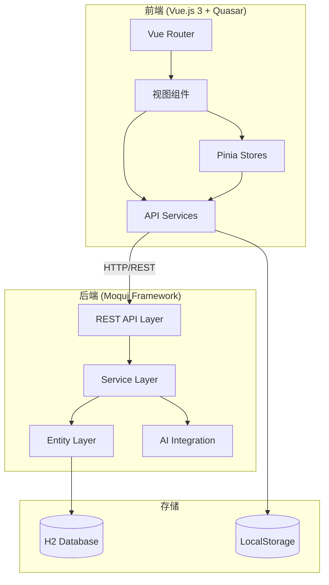
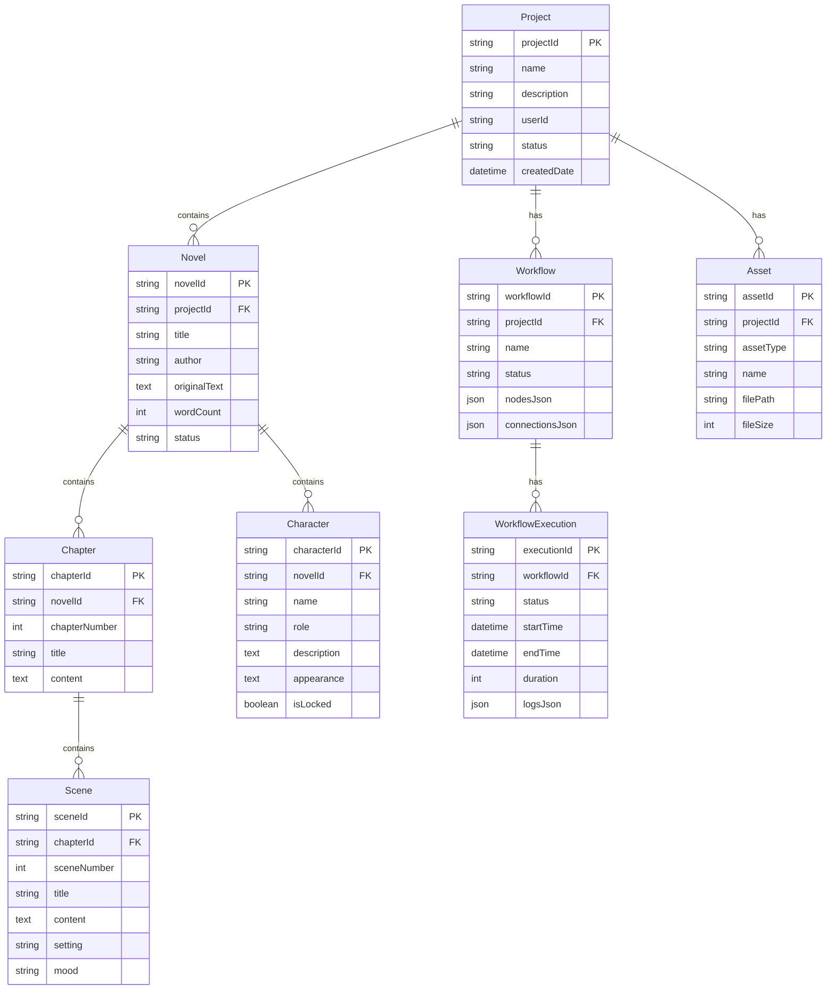
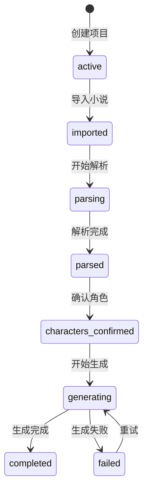

# 系统集成设计文档

## 概述

本设计文档描述小说动漫生成器（Novel Anime Generator）前后端系统集成的技术架构和实现方案。系统采用 Vue.js 3 + Quasar 前端与 Moqui Framework 后端的分离架构，通过 REST API 进行通信。

## 架构

### 系统架构图



### 前端架构

```
frontend/NovelAnimeDesktop/src/renderer/
├── router/           # 路由配置
│   └── index.js      # 14个路由定义
├── views/            # 视图组件
│   ├── DashboardView.vue      # 仪表盘
│   ├── LoginView.vue          # 登录
│   ├── MyProjectsView.vue     # 项目列表
│   ├── ProjectDetailView.vue  # 项目详情
│   ├── WorkflowEditor.vue     # 工作流编辑器
│   ├── GeneratedContentView.vue # 生成结果
│   ├── CharactersView.vue     # 角色列表
│   ├── CharacterDetailView.vue # 角色详情
│   ├── NovelsView.vue         # 小说列表
│   ├── AssetsView.vue         # 资源库
│   ├── Settings.vue           # 设置
│   └── ProfileView.vue        # 个人资料
├── stores/           # Pinia 状态管理
│   ├── navigation.js # 导航状态
│   ├── project.js    # 项目状态
│   ├── workflow.js   # 工作流状态
│   └── ui.js         # UI状态
├── services/         # API 服务层
│   ├── api.ts        # 主API服务
│   ├── novelApi.ts   # 小说API
│   ├── pipelineApi.ts # 管道API
│   └── PipelineOrchestrator.js # 工作流执行器
└── components/       # 可复用组件
```

### 后端架构

```
runtime/component/novel-anime-generator/
├── entity/
│   └── NovelAnimeEntities.xml  # 实体定义
├── service/
│   ├── novel-anime.rest.xml    # REST API定义
│   ├── NovelAnimeRestServices.xml
│   ├── NovelAnimeAuthServices.xml
│   ├── NovelAnimeAIServices.xml
│   ├── NovelAnimeWorkflowServices.xml
│   ├── NovelAnimeAssetServices.xml
│   ├── NovelAnimeCharacterServices.xml
│   ├── NovelAnimeSceneServices.xml
│   └── NovelAnimeUserSettingsServices.xml
└── data/
    └── NovelAnimeSetupData.xml # 初始数据
```

## 组件和接口

### API 服务层 (api.ts)

```typescript
class ApiService {
  baseURL: string = 'http://localhost:8080/rest/s1/novel-anime'
  axiosInstance: AxiosInstance
  
  // 认证
  async login(email: string, password: string): Promise<LoginResult>
  async logout(): Promise<boolean>
  async testConnection(): Promise<boolean>
  async testAIService(): Promise<boolean>
  
  // 项目管理
  async getProjects(userId?: string): Promise<ProjectsResult>
  async createProject(data: CreateProjectData): Promise<ProjectResult>
  async updateProject(projectId: string, data: UpdateProjectData): Promise<Result>
  
  // 工作流管理
  async getWorkflows(params?: WorkflowParams): Promise<WorkflowsResult>
  async createWorkflow(data: CreateWorkflowData): Promise<WorkflowResult>
  async updateWorkflow(workflowId: string, data: UpdateWorkflowData): Promise<Result>
  async deleteWorkflow(workflowId: string): Promise<Result>
  
  // 执行记录
  async getWorkflowExecutions(params?: ExecutionParams): Promise<ExecutionsResult>
  async createWorkflowExecution(data: CreateExecutionData): Promise<ExecutionResult>
  async updateWorkflowExecution(executionId: string, data: UpdateExecutionData): Promise<Result>
  
  // 模板管理
  async getWorkflowTemplates(params?: TemplateParams): Promise<TemplatesResult>
  async createWorkflowTemplate(data: CreateTemplateData): Promise<TemplateResult>
  async deleteWorkflowTemplate(templateId: string): Promise<Result>
  
  // 资源管理
  async getAssets(params?: AssetParams): Promise<AssetsResult>
  async createAsset(data: CreateAssetData): Promise<AssetResult>
  async deleteAsset(assetId: string): Promise<Result>
  
  // 用户设置
  async getUserSettings(userId?: string): Promise<SettingsResult>
  async updateUserSettings(data: UpdateSettingsData): Promise<SettingsResult>
}
```

### 小说 API (novelApi.ts)

```typescript
const novelApi = {
  // 小说导入
  importText(data: { projectId: string, title: string, content: string }): Promise<NovelResult>
  importFile(data: { projectId: string, file: File }): Promise<NovelResult>
  
  // 小说查询
  listNovels(projectId?: string): Promise<NovelsResult>
  getNovel(novelId: string): Promise<NovelResult>
  
  // AI 分析
  analyzeStructure(novelId: string): Promise<AnalysisResult>
  extractCharacters(novelId: string): Promise<CharactersResult>
}
```

### 工作流执行器 (PipelineOrchestrator.js)

```javascript
class PipelineOrchestrator {
  // 执行工作流
  async execute(workflow, options): Promise<ExecutionResult>
  
  // 节点处理器
  async processNode(node, inputData): Promise<NodeResult>
  
  // 节点类型处理
  async processNovelParser(node, inputData): Promise<ParserResult>
  async processCharacterAnalyzer(node, inputData): Promise<AnalyzerResult>
  async processSceneGenerator(node, inputData): Promise<SceneResult>
  async processScriptConverter(node, inputData): Promise<ScriptResult>
  async processVideoGenerator(node, inputData): Promise<VideoResult>
}
```

## 数据模型

### 核心实体



### 状态流转



## 正确性属性

*正确性属性是系统必须满足的特性，通过属性测试验证这些特性在所有有效输入下都成立。*

### Property 1: 认证状态一致性
*For any* 用户会话，如果 localStorage 中存在有效的 JWT token，则系统应允许访问受保护的路由；如果 token 不存在或无效，则应重定向到登录页面。
**Validates: Requirements 1.1, 1.2, 1.3**

### Property 2: 项目列表完整性
*For any* 用户，调用 getProjects API 返回的项目列表应包含该用户创建的所有项目，且每个项目都包含必要的字段（projectId, name, status）。
**Validates: Requirements 3.1**

### Property 3: 项目创建幂等性
*For any* 有效的项目创建请求，调用 createProject API 应返回唯一的 projectId，且后续调用 getProject(projectId) 应返回相同的项目数据。
**Validates: Requirements 3.2**

### Property 4: 小说导入完整性
*For any* 有效的小说文本内容，导入后调用 getNovel API 应返回包含原始内容的小说数据，且 novelId 应存储在 localStorage 中。
**Validates: Requirements 4.2, 4.3**

### Property 5: 解析状态转换
*For any* 已导入的小说，调用 analyzeStructure 后项目状态应从 "imported" 转换为 "parsed"，且应创建相应的章节和场景数据。
**Validates: Requirements 4.5, 4.6**

### Property 6: 角色数据一致性
*For any* 已解析的小说，调用 getCharacters API 返回的角色列表应与 extractCharacters 提取的角色一致，且每个角色都包含必要的字段。
**Validates: Requirements 5.1**

### Property 7: 工作流节点完整性
*For any* 工作流，添加节点后 nodesJson 应包含该节点，删除节点后 nodesJson 应不包含该节点，且节点 ID 应唯一。
**Validates: Requirements 6.3**

### Property 8: 工作流连接有效性
*For any* 工作流连接，源节点和目标节点都必须存在于 nodesJson 中，且连接不应形成循环。
**Validates: Requirements 6.4**

### Property 9: 执行记录完整性
*For any* 工作流执行，创建执行记录后应包含 startTime 和 nodeCount，完成后应包含 endTime、duration 和 status。
**Validates: Requirements 12.4, 12.5**

### Property 10: 执行进度单调性
*For any* 工作流执行过程，执行进度应单调递增（0% -> 100%），且每个节点完成后进度应增加。
**Validates: Requirements 7.3, 7.4**

### Property 11: 资源类型过滤正确性
*For any* 资源类型筛选，返回的资源列表中所有资源的 assetType 应与筛选条件匹配。
**Validates: Requirements 9.3**

### Property 12: 用户设置持久性
*For any* 用户设置更新，调用 updateUserSettings 后再调用 getUserSettings 应返回更新后的设置值。
**Validates: Requirements 10.2, 10.3, 10.4**

### Property 13: 模板应用正确性
*For any* 工作流模板，应用模板后创建的工作流应包含模板定义的所有节点，且节点之间应按模板定义连接。
**Validates: Requirements 6.7, 11.3**

### Property 14: 最近项目列表限制
*For any* 仪表盘显示，最近项目列表应最多显示 5 个项目，且按更新时间降序排列。
**Validates: Requirements 2.3**

### Property 15: 生成结果章节场景对应
*For any* 生成结果，选择章节后显示的场景应全部属于该章节，且场景数量应与章节的场景总数一致。
**Validates: Requirements 8.2, 8.3**

## 错误处理

### 网络错误处理

```typescript
// API 服务层统一错误处理
axiosInstance.interceptors.response.use(
  (response) => response,
  (error) => {
    if (error.response?.status === 401) {
      // Token 过期，清除认证状态
      localStorage.removeItem('novel_anime_access_token')
      router.push('/login')
    } else if (error.response?.status === 500) {
      // 服务器错误，显示通知
      uiStore.addNotification({
        type: 'error',
        title: '服务器错误',
        message: '请稍后重试'
      })
    } else if (!error.response) {
      // 网络错误
      uiStore.addNotification({
        type: 'error',
        title: '网络错误',
        message: '无法连接到服务器'
      })
    }
    return Promise.reject(error)
  }
)
```

### 业务错误处理

| 错误场景 | 处理方式 |
|---------|---------|
| 项目不存在 | 显示错误提示，返回项目列表 |
| 小说解析失败 | 显示错误信息，允许重试 |
| 工作流验证失败 | 显示验证错误，阻止执行 |
| 执行超时 | 记录错误，允许重试 |
| 资源上传失败 | 显示错误，保留表单数据 |

## 测试策略

### 单元测试

- 使用 Vitest 进行前端单元测试
- 测试 API 服务层的请求/响应处理
- 测试 Pinia Store 的状态管理逻辑
- 测试工具函数和数据转换

### 属性测试

- 使用 fast-check 进行属性测试
- 每个属性测试运行 100 次迭代
- 测试标签格式: `Feature: system-integration, Property N: {property_text}`

### 集成测试

- 测试前后端 API 集成
- 测试完整的用户流程（导入 -> 解析 -> 生成）
- 测试错误处理和边界情况

### 测试覆盖目标

| 模块 | 单元测试 | 属性测试 | 集成测试 |
|-----|---------|---------|---------|
| 认证 | ✅ | ✅ | ✅ |
| 项目管理 | ✅ | ✅ | ✅ |
| 小说导入 | ✅ | ✅ | ✅ |
| 工作流 | ✅ | ✅ | ✅ |
| 执行 | ✅ | ✅ | ✅ |
| 资源 | ✅ | ✅ | - |
| 设置 | ✅ | ✅ | - |
