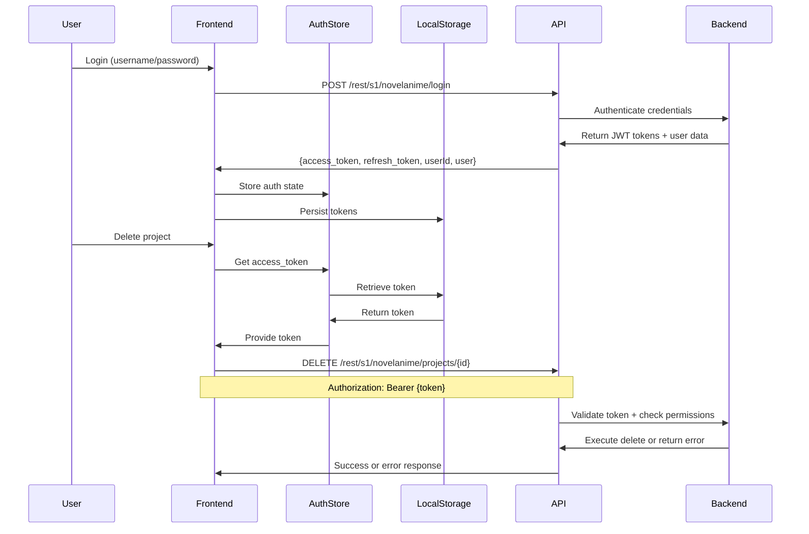
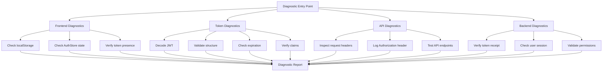

# Design Document: Authentication Diagnosis and Fix

## Overview

This design addresses the authentication issue where the backend returns "User [No User] is not authorized" despite frontend authentication state appearing valid. The solution involves systematic diagnosis of the authentication chain, identification of the root cause, and implementation of a robust fix with comprehensive testing.

The approach follows a diagnostic-first methodology: create tools to inspect each layer of the authentication system, identify where the chain breaks, then implement targeted fixes with validation at each step.

## Architecture

### Authentication Flow



### Diagnostic Architecture



## Components and Interfaces

### 1. Diagnostic Scripts

#### Frontend Diagnostic Script
```typescript
// Location: .kiro/specs/08-02-auth-diagnosis-fix/scripts/diagnose-frontend.ts

interface FrontendDiagnosticResult {
  localStorageTokens: {
    access_token: string | null;
    refresh_token: string | null;
    userId: string | null;
    user: object | null;
  };
  authStoreState: {
    isAuthenticated: boolean;
    currentUser: object | null;
    token: string | null;
  };
  issues: string[];
}

function diagnoseFrontend(): FrontendDiagnosticResult;
```

#### Token Diagnostic Script
```typescript
// Location: .kiro/specs/08-02-auth-diagnosis-fix/scripts/diagnose-token.ts

interface TokenDiagnosticResult {
  tokenPresent: boolean;
  tokenValid: boolean;
  decodedPayload: object | null;
  expirationTime: Date | null;
  isExpired: boolean;
  claims: {
    userId?: string;
    username?: string;
    roles?: string[];
    [key: string]: any;
  };
  issues: string[];
}

function diagnoseToken(token: string): TokenDiagnosticResult;
```

#### API Diagnostic Script
```typescript
// Location: .kiro/specs/08-02-auth-diagnosis-fix/scripts/diagnose-api.ts

interface APIDiagnosticResult {
  requestHeaders: Record<string, string>;
  authorizationHeader: string | null;
  responseStatus: number;
  responseBody: any;
  backendUserRecognized: boolean;
  issues: string[];
}

async function diagnoseAPI(endpoint: string, method: string): Promise<APIDiagnosticResult>;
```

#### Backend Diagnostic Script
```bash
# Location: .kiro/specs/08-02-auth-diagnosis-fix/scripts/diagnose-backend.sh

# Tests backend authentication endpoints directly
# Verifies token validation and user session establishment
```

### 2. Authentication Service Enhancements

#### Enhanced API Service
```typescript
// Location: frontend/NovelAnimeDesktop/src/renderer/services/api.ts

interface APIConfig {
  baseURL: string;
  timeout: number;
  withCredentials: boolean;
}

class APIService {
  private axiosInstance: AxiosInstance;
  
  constructor(config: APIConfig);
  
  // Intercept requests to add authentication
  private setupRequestInterceptor(): void;
  
  // Intercept responses to handle auth errors
  private setupResponseInterceptor(): void;
  
  // Enhanced logging for debugging
  private logRequest(config: AxiosRequestConfig): void;
  private logResponse(response: AxiosResponse): void;
  private logError(error: AxiosError): void;
}
```

#### Enhanced Auth Store
```typescript
// Location: frontend/NovelAnimeDesktop/src/renderer/stores/authStore.ts

interface AuthState {
  isAuthenticated: boolean;
  user: User | null;
  userId: string | null;
  accessToken: string | null;
  refreshToken: string | null;
  tokenExpiration: Date | null;
}

interface AuthStore {
  // State
  state: AuthState;
  
  // Getters
  isAuthenticated: boolean;
  currentUser: User | null;
  authHeader: string | null; // Returns "Bearer {token}"
  
  // Actions
  login(username: string, password: string): Promise<void>;
  logout(): void;
  refreshToken(): Promise<void>;
  persistTokens(authData: AuthResponse): void;
  loadTokens(): void;
  validateToken(): boolean;
  
  // Diagnostic
  getAuthState(): AuthState;
  debugAuthState(): void;
}
```

### 3. Logging and Monitoring

#### Authentication Logger
```typescript
// Location: frontend/NovelAnimeDesktop/src/renderer/utils/authLogger.ts

enum LogLevel {
  DEBUG = 'DEBUG',
  INFO = 'INFO',
  WARN = 'WARN',
  ERROR = 'ERROR'
}

interface LogEntry {
  timestamp: Date;
  level: LogLevel;
  component: string;
  message: string;
  data?: any;
}

class AuthLogger {
  private logs: LogEntry[] = [];
  
  debug(component: string, message: string, data?: any): void;
  info(component: string, message: string, data?: any): void;
  warn(component: string, message: string, data?: any): void;
  error(component: string, message: string, data?: any): void;
  
  getLogs(level?: LogLevel): LogEntry[];
  exportLogs(): string; // Export as JSON
  clearLogs(): void;
}
```

## Data Models

### Authentication Response
```typescript
interface AuthResponse {
  access_token: string;
  refresh_token: string;
  token_type: string;
  expires_in: number;
  userId: string;
  user: {
    userId: string;
    username: string;
    emailAddress?: string;
    roles?: string[];
    permissions?: string[];
  };
}
```

### JWT Token Payload
```typescript
interface JWTPayload {
  // Standard claims
  iss?: string; // Issuer
  sub?: string; // Subject (userId)
  aud?: string; // Audience
  exp?: number; // Expiration time (Unix timestamp)
  nbf?: number; // Not before
  iat?: number; // Issued at
  jti?: string; // JWT ID
  
  // Custom claims (Moqui-specific)
  userId?: string;
  username?: string;
  roles?: string[];
  permissions?: string[];
  [key: string]: any;
}
```

### Diagnostic Report
```typescript
interface DiagnosticReport {
  timestamp: Date;
  frontend: FrontendDiagnosticResult;
  token: TokenDiagnosticResult;
  api: APIDiagnosticResult;
  backend: {
    tokenReceived: boolean;
    userSessionEstablished: boolean;
    permissionsValid: boolean;
    issues: string[];
  };
  summary: {
    overallStatus: 'PASS' | 'FAIL';
    criticalIssues: string[];
    recommendations: string[];
  };
}
```

## Correctness Properties

*A property is a characteristic or behavior that should hold true across all valid executions of a system—essentially, a formal statement about what the system should do. Properties serve as the bridge between human-readable specifications and machine-verifiable correctness guarantees.*

### Property 1: Token Persistence Round Trip
*For any* valid authentication response, storing tokens to localStorage and then loading them should produce equivalent authentication state.
**Validates: Requirements 2.2, 2.3, 2.4**

### Property 2: Authorization Header Format
*For any* authenticated API request, the Authorization header should be present and formatted as "Bearer {valid_token}".
**Validates: Requirements 3.1, 3.2**

### Property 3: Token Expiration Handling
*For any* expired token, attempting to make an API request should trigger token refresh or re-authentication, not silent failure.
**Validates: Requirements 2.5, 3.3**

### Property 4: Authentication State Consistency
*For any* point in time, if the auth store shows isAuthenticated=true, then localStorage must contain a valid access_token.
**Validates: Requirements 1.1, 2.2**

### Property 5: Diagnostic Completeness
*For any* diagnostic run, all five diagnostic areas (frontend, token, API, backend, summary) must be checked and reported.
**Validates: Requirements 6.1, 6.2, 6.3, 6.4, 6.5**

### Property 6: JWT Token Structure Validity
*For any* JWT token stored in the system, decoding it should produce a valid payload with required claims (sub or userId, exp, iat).
**Validates: Requirements 1.2, 4.2**

### Property 7: API Request Authentication Consistency
*For any* API request (GET, POST, PUT, DELETE), the authentication mechanism should be identical across all request types.
**Validates: Requirements 3.4**

### Property 8: Error Message Clarity
*For any* authentication failure, the system should provide a descriptive error message indicating the specific failure reason.
**Validates: Requirements 3.5, 4.5**

## Error Handling

### Frontend Error Handling

1. **Token Not Found**
   - Scenario: localStorage has no access_token
   - Action: Redirect to login page
   - User Message: "Please log in to continue"

2. **Token Expired**
   - Scenario: JWT exp claim is in the past
   - Action: Attempt token refresh, fallback to login
   - User Message: "Your session has expired. Please log in again"

3. **Invalid Token Format**
   - Scenario: Token cannot be decoded or has invalid structure
   - Action: Clear invalid token, redirect to login
   - User Message: "Authentication error. Please log in again"

4. **API Request Failed (401)**
   - Scenario: Backend returns 401 Unauthorized
   - Action: Log error, attempt token refresh, fallback to login
   - User Message: "Authentication failed. Please log in again"

5. **API Request Failed (403)**
   - Scenario: Backend returns 403 Forbidden
   - Action: Log error, show permission error
   - User Message: "You don't have permission to perform this action"

### Backend Error Handling

1. **Missing Authorization Header**
   - Response: 401 Unauthorized
   - Body: `{"error": "Missing Authorization header"}`

2. **Invalid Token Format**
   - Response: 401 Unauthorized
   - Body: `{"error": "Invalid token format. Expected: Bearer {token}"}`

3. **Token Validation Failed**
   - Response: 401 Unauthorized
   - Body: `{"error": "Token validation failed: {reason}"}`

4. **Insufficient Permissions**
   - Response: 403 Forbidden
   - Body: `{"error": "User does not have permission to perform this action"}`

### Diagnostic Error Handling

1. **Diagnostic Script Failure**
   - Action: Log error, continue with remaining diagnostics
   - Report: Mark failed diagnostic as "ERROR" with error message

2. **Backend Unreachable**
   - Action: Log error, mark backend diagnostics as unavailable
   - Report: Include connectivity issue in summary

## Testing Strategy

### Dual Testing Approach

This project uses both unit tests and property-based tests for comprehensive coverage:

- **Unit tests**: Verify specific examples, edge cases, and error conditions
- **Property tests**: Verify universal properties across all inputs using randomized testing

Both approaches are complementary and necessary. Unit tests catch concrete bugs in specific scenarios, while property tests verify general correctness across a wide range of inputs.

### Property-Based Testing Configuration

- **Library**: fast-check (for TypeScript/JavaScript)
- **Minimum iterations**: 100 per property test
- **Tag format**: `// Feature: 08-02-auth-diagnosis-fix, Property {N}: {property text}`

Each correctness property listed above must be implemented as a single property-based test.

### Unit Testing Focus

Unit tests should focus on:
- Specific authentication flow examples (login, logout, token refresh)
- Edge cases (expired tokens, malformed tokens, missing tokens)
- Error conditions (network failures, invalid credentials, permission errors)
- Integration points (localStorage persistence, API interceptors)

Avoid writing too many unit tests for scenarios that property tests already cover comprehensively.

### Test Organization

```
frontend/NovelAnimeDesktop/src/renderer/
├── stores/__tests__/
│   ├── authStore.spec.ts          # Unit tests for auth store
│   └── authStore.property.spec.ts # Property tests for auth store
├── services/__tests__/
│   ├── api.spec.ts                # Unit tests for API service
│   └── api.property.spec.ts       # Property tests for API service
└── utils/__tests__/
    ├── authLogger.spec.ts         # Unit tests for logger
    └── tokenValidator.spec.ts     # Unit tests for token validation
```

### Diagnostic Testing

```
.kiro/specs/08-02-auth-diagnosis-fix/
├── scripts/
│   ├── diagnose-frontend.ts
│   ├── diagnose-token.ts
│   ├── diagnose-api.ts
│   └── diagnose-backend.sh
└── tests/
    ├── diagnostic.spec.ts         # Tests for diagnostic scripts
    └── integration.spec.ts        # End-to-end authentication tests
```

### Test Execution

```bash
# Run all tests
npm test

# Run specific test suites
npm test -- authStore
npm test -- api
npm test -- diagnostic

# Run property tests only
npm test -- --grep "Property"

# Run with coverage
npm test -- --coverage
```

### Integration Testing

End-to-end tests should verify:
1. Complete login flow (credentials → tokens → authenticated state)
2. Authenticated API requests (with proper headers)
3. Token persistence across page reloads
4. Token refresh on expiration
5. Delete operation with authentication
6. Logout and state cleanup

### Manual Testing Checklist

After implementation, manually verify:
- [ ] Login with admin/admin succeeds
- [ ] Tokens are stored in localStorage
- [ ] Auth store shows authenticated state
- [ ] API requests include Authorization header
- [ ] Delete project operation succeeds
- [ ] Page reload maintains authentication
- [ ] Logout clears all auth state
- [ ] Diagnostic scripts run successfully
- [ ] Diagnostic report shows no critical issues

## Implementation Notes

### Phase 1: Diagnostic Tools
Create all diagnostic scripts first to establish visibility into the authentication system. This allows us to identify the root cause before implementing fixes.

### Phase 2: Root Cause Identification
Run diagnostics and analyze results to pinpoint where the authentication chain breaks. Document findings in a diagnostic report.

### Phase 3: Targeted Fixes
Based on diagnostic findings, implement specific fixes:
- If token generation is broken: Fix login endpoint integration
- If token storage is broken: Fix localStorage persistence
- If token transmission is broken: Fix API interceptors
- If backend validation is broken: Fix backend configuration or token format

### Phase 4: Validation
After fixes, re-run diagnostics to verify all issues are resolved. Run comprehensive tests to ensure no regressions.

### Phase 5: Documentation
Document the authentication flow, common issues, and troubleshooting steps for future maintenance.

## Dependencies

- **fast-check**: Property-based testing library
- **vitest**: Test framework
- **axios**: HTTP client (already in use)
- **jwt-decode**: JWT token decoding library
- **pinia**: State management (already in use)

## Security Considerations

1. **Token Storage**: Tokens stored in localStorage are vulnerable to XSS attacks. Consider using httpOnly cookies for production.
2. **Token Logging**: Ensure tokens are never logged in production environments.
3. **Token Expiration**: Implement proper token expiration and refresh mechanisms.
4. **HTTPS**: Ensure all API communication uses HTTPS in production.
5. **CORS**: Verify CORS configuration allows authenticated requests.

## Future Enhancements

1. **Token Refresh**: Implement automatic token refresh before expiration
2. **Secure Storage**: Migrate from localStorage to more secure storage mechanism
3. **Session Management**: Implement proper session timeout and idle detection
4. **Multi-factor Authentication**: Add MFA support for enhanced security
5. **Audit Logging**: Log all authentication events for security auditing
