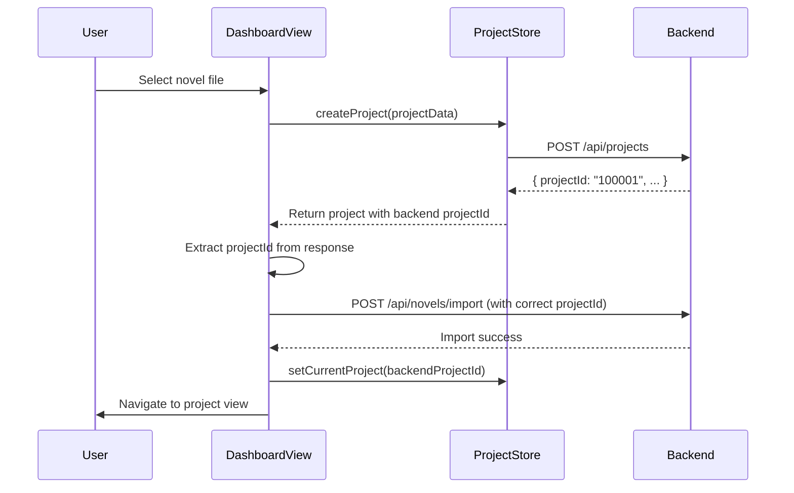

# Design Document

## Overview

This design addresses the project ID mismatch bug in the novel import workflow. The root cause is that the frontend's `DashboardView.vue` component uses a client-generated projectId (from `ProjectManager.js`) instead of the backend-returned projectId when calling the novel import API. This design ensures that the backend-generated projectId flows correctly through the entire workflow from project creation to novel import.

The fix involves modifying the `uploadNovelToBackend` function in `DashboardView.vue` to correctly capture and use the projectId returned by the backend's project creation API, and ensuring that this projectId is consistently used throughout the workflow.

## Architecture

### Current Problematic Flow

```
User selects novel file
    ↓
Frontend: DashboardView.uploadNovelToBackend()
    ↓
Frontend: projectStore.createProject() → Backend API: create project
    ↓
Backend returns: { projectId: "100001", ... }
    ↓
Frontend: projectStore.setCurrentProject() [uses client-generated ID]
    ↓
Frontend: API call to import novel with wrong projectId
    ↓
Backend: "Project not found" error
```

### Fixed Flow

```
User selects novel file
    ↓
Frontend: DashboardView.uploadNovelToBackend()
    ↓
Frontend: projectStore.createProject() → Backend API: create project
    ↓
Backend returns: { projectId: "100001", ... }
    ↓
Frontend: Extract and store backend projectId
    ↓
Frontend: API call to import novel with correct projectId
    ↓
Backend: Successfully imports novel
    ↓
Frontend: Navigate to project with correct projectId
```

### Component Interaction



## Components and Interfaces

### 1. DashboardView.vue (Frontend)

**File**: `frontend/NovelAnimeDesktop/src/renderer/views/DashboardView.vue`

**Modified Function**: `uploadNovelToBackend()`

**Current Issue**:
- Line ~850: Creates project via `projectStore.createProject()`
- Line ~860: Calls `projectStore.setCurrentProject()` which may use client-generated ID
- Line ~870: Uses potentially wrong projectId in novel import API call

**Required Changes**:
```javascript
async uploadNovelToBackend(file, projectName, projectDescription) {
  try {
    // Step 1: Create project via backend
    const projectData = {
      name: projectName,
      description: projectDescription,
      // ... other fields
    };
    
    const createdProject = await projectStore.createProject(projectData);
    
    // Step 2: Extract backend-generated projectId
    const backendProjectId = createdProject.projectId;
    
    if (!backendProjectId) {
      throw new Error('Backend did not return a valid projectId');
    }
    
    console.log('Using backend projectId for novel import:', backendProjectId);
    
    // Step 3: Import novel using the correct projectId
    const formData = new FormData();
    formData.append('file', file);
    formData.append('projectId', backendProjectId);  // Use backend ID
    formData.append('projectName', projectName);
    
    const importResponse = await fetch('/api/novels/import', {
      method: 'POST',
      body: formData
    });
    
    if (!importResponse.ok) {
      throw new Error('Novel import failed');
    }
    
    // Step 4: Set current project with backend projectId
    await projectStore.setCurrentProject(backendProjectId);
    
    // Step 5: Navigate to project
    this.$router.push(`/project/${backendProjectId}`);
    
  } catch (error) {
    console.error('Upload failed:', error);
    this.showError(error.message);
  }
}
```

**Interface**:
- **Input**: `file` (File object), `projectName` (string), `projectDescription` (string)
- **Output**: None (side effects: creates project, imports novel, navigates to project)
- **Dependencies**: `projectStore`, `fetch` API, `$router`

### 2. ProjectStore (Frontend)

**File**: `frontend/NovelAnimeDesktop/src/renderer/stores/project.js`

**Modified Method**: `createProject()`

**Required Behavior**:
- Must return the complete project object from the backend response
- Must include the backend-generated `projectId` in the returned object
- Must NOT override the backend projectId with a client-generated ID

**Interface**:
```javascript
async createProject(projectData) {
  const response = await fetch('/api/projects', {
    method: 'POST',
    headers: { 'Content-Type': 'application/json' },
    body: JSON.stringify(projectData)
  });
  
  const project = await response.json();
  
  // Return the project with backend projectId intact
  return project;  // Must include project.projectId from backend
}
```

**Modified Method**: `setCurrentProject()`

**Required Behavior**:
- Must accept a backend projectId as parameter
- Must fetch project details from backend using that projectId
- Must store the project with the backend projectId

**Interface**:
```javascript
async setCurrentProject(projectId) {
  // Fetch project from backend using the provided projectId
  const response = await fetch(`/api/projects/${projectId}`);
  const project = await response.json();
  
  // Store in state with backend projectId
  this.currentProject = project;
  
  // If using local storage, persist with backend projectId
  localStorage.setItem('currentProjectId', projectId);
}
```

### 3. ProjectManager.js (Frontend)

**File**: `frontend/NovelAnimeDesktop/src/renderer/services/ProjectManager.js`

**Current Issue**:
- Generates client-side IDs in format: `project_{timestamp}_{random}`
- These IDs should NOT be used for backend API calls

**Required Changes**:
- Client-generated IDs should only be used for local/temporary state
- Backend API calls must use backend-generated projectIds
- Clear separation between local IDs and backend IDs

**Recommendation**: 
- Keep client ID generation for local-only operations
- Add clear documentation that these IDs are NOT for backend use
- Consider renaming to `generateLocalProjectId()` for clarity

### 4. Backend Services (No Changes Required)

**File**: `runtime/component/novel-anime-generator/service/NovelAnimeRestServices.xml`

**Service**: `create#NovelFromText`

**Current Behavior** (Correct):
- Validates that projectId exists in database
- Returns error if project not found
- This behavior is correct and should be maintained

**No changes needed** - the backend is working correctly. The fix is entirely on the frontend.

## Data Models

### Project Object (Backend Response)

```javascript
{
  projectId: "100001",           // Backend-generated, database primary key
  name: "My Novel Project",
  description: "A fantasy novel",
  createdDate: "2025-01-25T10:30:00Z",
  status: "active",
  // ... other fields
}
```

**Key Field**: `projectId` - This is the authoritative identifier that must be used for all backend operations.

### Novel Import Request

```javascript
// FormData structure
{
  file: File,                    // The novel text file
  projectId: "100001",          // Must be backend-generated projectId
  projectName: "My Novel Project"
}
```

**Critical**: The `projectId` field must match a projectId that exists in the backend database.

## Correctness Properties

*A property is a characteristic or behavior that should hold true across all valid executions of a system—essentially, a formal statement about what the system should do. Properties serve as the bridge between human-readable specifications and machine-verifiable correctness guarantees.*


### Property 1: Backend ProjectId Storage

*For any* project created via the backend API, the frontend should store the exact projectId returned by the backend in its local state.

**Validates: Requirements 1.1, 2.2, 4.1**

### Property 2: ProjectId Consistency Throughout Workflow

*For any* complete workflow (create project → import novel → navigate), the projectId used in each step should be identical to the backend-returned projectId from the initial project creation.

**Validates: Requirements 1.2, 2.3, 4.3, 5.2, 5.4**

### Property 3: Backend Accepts Valid ProjectIds

*For any* projectId returned by the backend's project creation API, using that projectId in a subsequent novel import API call should result in successful project lookup (not "Project not found" error).

**Validates: Requirements 1.3**

### Property 4: No Client-Generated IDs in Backend Calls

*For any* backend API call made by the frontend, the projectId parameter should never match the client-generated ID format (project_{timestamp}_{random}).

**Validates: Requirements 1.4**

### Property 5: No ID Mixing in Workflows

*For any* single workflow execution, all projectId values used should be identical - there should be no switching between client-generated and backend-generated IDs.

**Validates: Requirements 1.5**

### Property 6: Backend Returns ProjectId on Creation

*For any* project creation request to the backend, the response should contain a non-empty projectId field.

**Validates: Requirements 2.1**

### Property 7: Local Storage Persistence

*For any* project stored in local storage, retrieving it should return the same backend projectId that was originally stored.

**Validates: Requirements 4.4**

### Property 8: Navigation Uses Correct ProjectId

*For any* successful novel import, the subsequent navigation should use the backend projectId in the route path.

**Validates: Requirements 5.3**

## Error Handling

### Frontend Error Handling

**Missing ProjectId Validation**:
```javascript
if (!backendProjectId) {
  throw new Error('Backend did not return a valid projectId');
}
```
- Validates that the backend response contains a projectId before proceeding
- Prevents attempting novel import with undefined/null projectId

**API Call Failures**:
```javascript
if (!importResponse.ok) {
  const errorData = await importResponse.json();
  throw new Error(`Novel import failed: ${errorData.message}`);
}
```
- Captures and displays backend error messages
- Provides clear feedback to the user

**Network Errors**:
```javascript
try {
  // API calls
} catch (error) {
  console.error('Upload failed:', error);
  this.showError(`Failed to import novel: ${error.message}`);
}
```
- Catches network failures and other exceptions
- Displays user-friendly error messages

### Backend Error Handling (Existing - No Changes)

The backend already correctly handles invalid projectIds:
- Returns 404 with message "Project not found: {projectId}"
- This behavior is correct and should be maintained

### Error Scenarios

1. **Backend doesn't return projectId**: Frontend throws error before attempting import
2. **Invalid projectId in import**: Backend returns "Project not found" error
3. **Network failure**: Frontend catches and displays error message
4. **Project creation fails**: Frontend doesn't proceed to import step

## Testing Strategy

### Dual Testing Approach

This fix requires both unit tests and property-based tests to ensure comprehensive coverage:

- **Unit tests**: Verify specific scenarios and edge cases
- **Property tests**: Verify universal properties across all inputs

### Unit Testing

**Focus Areas**:
- Specific example: Create project with known data, verify projectId is stored
- Edge case: Backend returns response without projectId field
- Edge case: Backend returns empty string as projectId
- Error condition: Network failure during project creation
- Error condition: Backend returns 404 for invalid projectId
- Integration: Complete workflow from file selection to navigation

**Example Unit Tests**:
```javascript
describe('DashboardView.uploadNovelToBackend', () => {
  it('should store backend projectId after project creation', async () => {
    const mockProject = { projectId: '100001', name: 'Test' };
    mockBackend.createProject.mockResolvedValue(mockProject);
    
    await dashboardView.uploadNovelToBackend(file, 'Test', 'Description');
    
    expect(projectStore.currentProject.projectId).toBe('100001');
  });
  
  it('should throw error if backend does not return projectId', async () => {
    mockBackend.createProject.mockResolvedValue({ name: 'Test' });
    
    await expect(
      dashboardView.uploadNovelToBackend(file, 'Test', 'Description')
    ).rejects.toThrow('Backend did not return a valid projectId');
  });
  
  it('should use backend projectId in novel import API call', async () => {
    const mockProject = { projectId: '100001', name: 'Test' };
    mockBackend.createProject.mockResolvedValue(mockProject);
    
    await dashboardView.uploadNovelToBackend(file, 'Test', 'Description');
    
    expect(mockBackend.importNovel).toHaveBeenCalledWith(
      expect.objectContaining({ projectId: '100001' })
    );
  });
});
```

### Property-Based Testing

**Testing Library**: Use `fast-check` for JavaScript/TypeScript property-based testing

**Configuration**: Minimum 100 iterations per property test

**Property Tests**:

Each property test must reference its design document property using the tag format:
**Feature: 10-01-fix-novel-import-project-id, Property {number}: {property_text}**

```javascript
import fc from 'fast-check';

describe('Property Tests: ProjectId Consistency', () => {
  
  // Feature: 10-01-fix-novel-import-project-id, Property 1: Backend ProjectId Storage
  it('should store backend-returned projectId for any project data', () => {
    fc.assert(
      fc.asyncProperty(
        fc.record({
          name: fc.string({ minLength: 1, maxLength: 100 }),
          description: fc.string({ maxLength: 500 })
        }),
        async (projectData) => {
          const mockProjectId = `${Math.floor(Math.random() * 1000000)}`;
          mockBackend.createProject.mockResolvedValue({
            ...projectData,
            projectId: mockProjectId
          });
          
          await dashboardView.uploadNovelToBackend(mockFile, projectData.name, projectData.description);
          
          expect(projectStore.currentProject.projectId).toBe(mockProjectId);
        }
      ),
      { numRuns: 100 }
    );
  });
  
  // Feature: 10-01-fix-novel-import-project-id, Property 2: ProjectId Consistency Throughout Workflow
  it('should use same projectId throughout workflow for any project', () => {
    fc.assert(
      fc.asyncProperty(
        fc.record({
          name: fc.string({ minLength: 1, maxLength: 100 }),
          description: fc.string({ maxLength: 500 })
        }),
        async (projectData) => {
          const mockProjectId = `${Math.floor(Math.random() * 1000000)}`;
          const capturedProjectIds = [];
          
          mockBackend.createProject.mockImplementation(async (data) => {
            return { ...data, projectId: mockProjectId };
          });
          
          mockBackend.importNovel.mockImplementation(async (formData) => {
            capturedProjectIds.push(formData.get('projectId'));
            return { success: true };
          });
          
          mockRouter.push.mockImplementation((path) => {
            const match = path.match(/\/project\/(.+)/);
            if (match) capturedProjectIds.push(match[1]);
          });
          
          await dashboardView.uploadNovelToBackend(mockFile, projectData.name, projectData.description);
          
          // All captured projectIds should be the same backend projectId
          expect(capturedProjectIds.every(id => id === mockProjectId)).toBe(true);
        }
      ),
      { numRuns: 100 }
    );
  });
  
  // Feature: 10-01-fix-novel-import-project-id, Property 4: No Client-Generated IDs in Backend Calls
  it('should never use client-generated ID format in backend calls', () => {
    fc.assert(
      fc.asyncProperty(
        fc.record({
          name: fc.string({ minLength: 1, maxLength: 100 }),
          description: fc.string({ maxLength: 500 })
        }),
        async (projectData) => {
          const mockProjectId = `${Math.floor(Math.random() * 1000000)}`;
          mockBackend.createProject.mockResolvedValue({
            ...projectData,
            projectId: mockProjectId
          });
          
          await dashboardView.uploadNovelToBackend(mockFile, projectData.name, projectData.description);
          
          const importCall = mockBackend.importNovel.mock.calls[0][0];
          const usedProjectId = importCall.get('projectId');
          
          // Should NOT match client-generated format: project_{timestamp}_{random}
          expect(usedProjectId).not.toMatch(/^project_\d+_[a-z0-9]+$/);
        }
      ),
      { numRuns: 100 }
    );
  });
  
  // Feature: 10-01-fix-novel-import-project-id, Property 7: Local Storage Persistence
  it('should persist and retrieve backend projectId correctly', () => {
    fc.assert(
      fc.asyncProperty(
        fc.string({ minLength: 1, maxLength: 20 }).filter(s => !s.includes('_')),
        async (projectId) => {
          localStorage.setItem('currentProjectId', projectId);
          const retrieved = localStorage.getItem('currentProjectId');
          
          expect(retrieved).toBe(projectId);
        }
      ),
      { numRuns: 100 }
    );
  });
});
```

### Test Coverage Goals

- **Unit Tests**: Cover all edge cases and error conditions
- **Property Tests**: Verify universal properties hold for all valid inputs
- **Integration Tests**: Test complete end-to-end workflow
- **Target Coverage**: 90%+ code coverage for modified components

### Testing Execution

1. Run unit tests after each code change
2. Run property tests before committing
3. Run integration tests before deployment
4. All tests must pass before merging

## Implementation Notes

### Key Changes Summary

1. **DashboardView.vue**: Modify `uploadNovelToBackend()` to correctly extract and use backend projectId
2. **ProjectStore**: Ensure `createProject()` returns complete backend response with projectId
3. **ProjectStore**: Ensure `setCurrentProject()` accepts and uses backend projectId
4. **ProjectManager.js**: Add documentation clarifying client IDs are for local use only

### Migration Considerations

- No database migration needed (backend is unchanged)
- No breaking API changes
- Frontend-only fix
- Backward compatible with existing projects

### Debugging Support

Add console logging at key points:
```javascript
console.log('Backend returned projectId:', backendProjectId);
console.log('Using projectId for novel import:', backendProjectId);
console.log('Navigating to project:', backendProjectId);
```

This will help diagnose any future ID mismatch issues.

### Code Review Checklist

- [ ] Backend projectId is extracted from API response
- [ ] Backend projectId is used in novel import API call
- [ ] Backend projectId is used in navigation
- [ ] No client-generated IDs are used for backend calls
- [ ] Error handling for missing projectId is present
- [ ] Console logging is added for debugging
- [ ] Unit tests cover edge cases
- [ ] Property tests verify universal properties
- [ ] All tests pass
