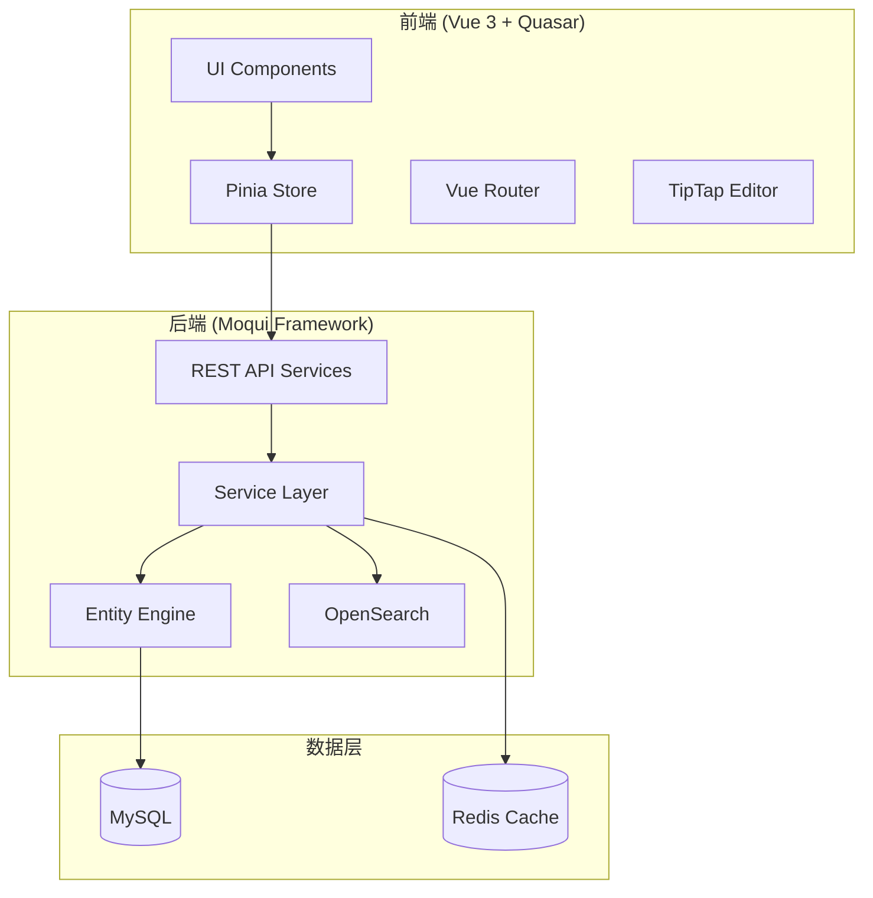
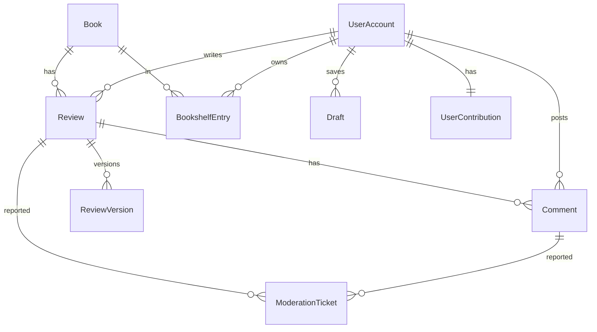

# Design Document: 中国版 Babelio MVP

## Overview

中国版 Babelio 是一个面向深度读者的高质量书评社区平台。本设计文档基于 Moqui Framework 后端和 Vue 3 + Quasar 前端技术栈，实现一个以内容质量为核心的书评与讨论系统。

核心设计理念：
- **质量优先**：通过 QualityWeightAlgorithm 替代传统点赞机制
- **三维评分**：思想深度、表达质量、可读性三个独立维度
- **长文优先**：500字最低门槛，鼓励深度思考
- **理性讨论**：内容审核与社区治理机制

## Architecture



### 系统分层

1. **表现层 (Presentation Layer)**
   - Vue 3 + Quasar 组件
   - TipTap 富文本编辑器
   - Pinia 状态管理

2. **服务层 (Service Layer)**
   - Moqui REST API
   - 业务逻辑处理
   - 权限验证

3. **数据层 (Data Layer)**
   - Moqui Entity Engine
   - MySQL 持久化
   - Redis 缓存
   - OpenSearch 全文搜索

## Components and Interfaces

### 后端组件 (Moqui Component)

```
runtime/component/babelio/
├── entity/                    # 实体定义
│   ├── BookEntities.xml       # 书籍相关实体
│   ├── ReviewEntities.xml     # 书评相关实体
│   ├── UserEntities.xml       # 用户相关实体
│   └── ModerationEntities.xml # 审核相关实体
├── service/                   # 服务定义
│   ├── BookServices.xml       # 书籍服务
│   ├── ReviewServices.xml     # 书评服务
│   ├── BookshelfServices.xml  # 书架服务
│   ├── DiscussionServices.xml # 讨论服务
│   ├── ModerationServices.xml # 审核服务
│   └── QualityServices.xml    # 质量算法服务
├── screen/                    # API 端点
│   └── api/
│       └── v1/
└── data/                      # 种子数据
```

### 前端组件 (Vue Components)

```
frontend/babelio/src/
├── components/
│   ├── book/
│   │   ├── BookCard.vue           # 书籍卡片
│   │   ├── BookDetail.vue         # 书籍详情
│   │   └── ThreeDimensionalRating.vue  # 三维评分组件
│   ├── review/
│   │   ├── ReviewEditor.vue       # 书评编辑器
│   │   ├── ReviewCard.vue         # 书评卡片
│   │   └── ReviewList.vue         # 书评列表
│   ├── bookshelf/
│   │   ├── BookshelfView.vue      # 书架视图
│   │   └── ShelfStatusSelector.vue # 状态选择器
│   ├── discussion/
│   │   ├── CommentList.vue        # 评论列表
│   │   ├── CommentEditor.vue      # 评论编辑器
│   │   └── QuoteBlock.vue         # 引用块
│   └── common/
│       ├── SearchBar.vue          # 搜索栏
│       └── Pagination.vue         # 分页组件
├── pages/
│   ├── HomePage.vue               # 首页
│   ├── BookPage.vue               # 书籍页
│   ├── ReviewPage.vue             # 书评页
│   ├── ProfilePage.vue            # 个人中心
│   └── SearchPage.vue             # 搜索页
├── stores/
│   ├── bookStore.ts               # 书籍状态
│   ├── reviewStore.ts             # 书评状态
│   ├── userStore.ts               # 用户状态
│   └── draftStore.ts              # 草稿状态
└── services/
    ├── bookApi.ts                 # 书籍 API
    ├── reviewApi.ts               # 书评 API
    └── searchApi.ts               # 搜索 API
```

### 核心接口定义

```typescript
// 三维评分接口
interface ThreeDimensionalRating {
  thoughtDepth: number;      // 思想深度 1-5
  expressionQuality: number; // 表达质量 1-5
  readability: number;       // 可读性 1-5
}

// 书籍接口
interface Book {
  bookId: string;
  isbn: string;
  title: string;
  author: string;
  publisher: string;
  publishDate: string;
  coverUrl: string;
  averageRating: ThreeDimensionalRating;
  reviewCount: number;
}

// 书评接口
interface Review {
  reviewId: string;
  bookId: string;
  userId: string;
  content: string;           // Markdown/HTML 内容
  rating: ThreeDimensionalRating;
  wordCount: number;
  qualityWeight: number;
  isFeatured: boolean;
  createdAt: string;
  updatedAt: string;
  versionHistory: ReviewVersion[];
}

// 草稿接口
interface Draft {
  draftId: string;
  bookId: string;
  userId: string;
  content: string;
  wordCount: number;
  lastSavedAt: string;
}

// 书架条目接口
interface BookshelfEntry {
  entryId: string;
  userId: string;
  bookId: string;
  status: 'want-to-read' | 'reading' | 'finished';
  isPrivate: boolean;
  statusChangedAt: string;
  addedAt: string;
}

// 评论接口
interface Comment {
  commentId: string;
  reviewId: string;
  userId: string;
  content: string;
  quotedText?: string;
  qualityScore: number;
  isHidden: boolean;
  createdAt: string;
}

// 用户贡献统计接口
interface UserContribution {
  userId: string;
  reviewCount: number;
  totalWordCount: number;
  averageQualityScore: number;
  contributionWeight: number;
}

// 审核工单接口
interface ModerationTicket {
  ticketId: string;
  contentType: 'review' | 'comment';
  contentId: string;
  reporterId: string;
  reason: string;
  evidence: string;
  status: 'pending' | 'resolved' | 'appealed';
  createdAt: string;
}
```

## Data Models

### Moqui Entity 定义

```xml
<!-- Book Entity -->
<entity entity-name="Book" package="babelio.book">
    <field name="bookId" type="id" is-pk="true"/>
    <field name="isbn" type="text-medium"/>
    <field name="title" type="text-medium"/>
    <field name="author" type="text-medium"/>
    <field name="publisher" type="text-medium"/>
    <field name="publishDate" type="date"/>
    <field name="coverUrl" type="text-long"/>
    <field name="avgThoughtDepth" type="number-decimal"/>
    <field name="avgExpressionQuality" type="number-decimal"/>
    <field name="avgReadability" type="number-decimal"/>
    <field name="reviewCount" type="number-integer"/>
    <index name="ISBN_IDX" unique="true">
        <index-field name="isbn"/>
    </index>
</entity>

<!-- Review Entity -->
<entity entity-name="Review" package="babelio.review">
    <field name="reviewId" type="id" is-pk="true"/>
    <field name="bookId" type="id"/>
    <field name="userId" type="id"/>
    <field name="content" type="text-very-long"/>
    <field name="contentJson" type="text-very-long"/>
    <field name="thoughtDepth" type="number-integer"/>
    <field name="expressionQuality" type="number-integer"/>
    <field name="readability" type="number-integer"/>
    <field name="wordCount" type="number-integer"/>
    <field name="qualityWeight" type="number-decimal"/>
    <field name="isFeatured" type="text-indicator"/>
    <field name="createdAt" type="date-time"/>
    <field name="updatedAt" type="date-time"/>
    <relationship type="one" related="babelio.book.Book"/>
    <relationship type="one" related="moqui.security.UserAccount" fk-name="USER_FK"/>
</entity>

<!-- ReviewVersion Entity -->
<entity entity-name="ReviewVersion" package="babelio.review">
    <field name="versionId" type="id" is-pk="true"/>
    <field name="reviewId" type="id"/>
    <field name="content" type="text-very-long"/>
    <field name="contentJson" type="text-very-long"/>
    <field name="versionNumber" type="number-integer"/>
    <field name="createdAt" type="date-time"/>
    <relationship type="one" related="babelio.review.Review"/>
</entity>

<!-- Draft Entity -->
<entity entity-name="Draft" package="babelio.review">
    <field name="draftId" type="id" is-pk="true"/>
    <field name="bookId" type="id"/>
    <field name="userId" type="id"/>
    <field name="content" type="text-very-long"/>
    <field name="wordCount" type="number-integer"/>
    <field name="lastSavedAt" type="date-time"/>
    <relationship type="one" related="babelio.book.Book"/>
</entity>

<!-- BookshelfEntry Entity -->
<entity entity-name="BookshelfEntry" package="babelio.bookshelf">
    <field name="entryId" type="id" is-pk="true"/>
    <field name="userId" type="id"/>
    <field name="bookId" type="id"/>
    <field name="status" type="text-short"/>
    <field name="isPrivate" type="text-indicator"/>
    <field name="statusChangedAt" type="date-time"/>
    <field name="addedAt" type="date-time"/>
    <relationship type="one" related="babelio.book.Book"/>
    <index name="USER_BOOK_IDX" unique="true">
        <index-field name="userId"/>
        <index-field name="bookId"/>
    </index>
</entity>

<!-- Comment Entity -->
<entity entity-name="Comment" package="babelio.discussion">
    <field name="commentId" type="id" is-pk="true"/>
    <field name="reviewId" type="id"/>
    <field name="userId" type="id"/>
    <field name="content" type="text-long"/>
    <field name="quotedText" type="text-long"/>
    <field name="qualityScore" type="number-decimal"/>
    <field name="isHidden" type="text-indicator"/>
    <field name="reportCount" type="number-integer"/>
    <field name="createdAt" type="date-time"/>
    <relationship type="one" related="babelio.review.Review"/>
</entity>

<!-- ModerationTicket Entity -->
<entity entity-name="ModerationTicket" package="babelio.moderation">
    <field name="ticketId" type="id" is-pk="true"/>
    <field name="contentType" type="text-short"/>
    <field name="contentId" type="id"/>
    <field name="reporterId" type="id"/>
    <field name="reason" type="text-medium"/>
    <field name="evidence" type="text-long"/>
    <field name="status" type="text-short"/>
    <field name="createdAt" type="date-time"/>
    <field name="resolvedAt" type="date-time"/>
</entity>

<!-- UserContribution Entity -->
<entity entity-name="UserContribution" package="babelio.user">
    <field name="userId" type="id" is-pk="true"/>
    <field name="reviewCount" type="number-integer"/>
    <field name="totalWordCount" type="number-integer"/>
    <field name="averageQualityScore" type="number-decimal"/>
    <field name="contributionWeight" type="number-decimal"/>
    <field name="lastUpdatedAt" type="date-time"/>
</entity>
```

### 数据关系图




## Correctness Properties

*A property is a characteristic or behavior that should hold true across all valid executions of a system-essentially, a formal statement about what the system should do. Properties serve as the bridge between human-readable specifications and machine-verifiable correctness guarantees.*

Based on the prework analysis, the following correctness properties have been identified. Redundant properties have been consolidated where one property can validate multiple related requirements.

### Property 1: Three-Dimensional Rating Completeness
*For any* book review submission, the system shall reject the submission if any of the three rating dimensions (thought depth, expression quality, readability) is missing or outside the valid range (1-5).
**Validates: Requirements 2.1**

### Property 2: Rating Aggregation Accuracy
*For any* book with multiple reviews, the displayed average rating for each dimension shall equal the weighted mathematical average of all individual ratings, where weights are determined by reviewer contribution history.
**Validates: Requirements 2.2, 2.4**

### Property 3: Minimum Review Length Enforcement
*For any* review submission attempt, if the content length is fewer than 500 characters, the system shall reject the submission and return an appropriate error message.
**Validates: Requirements 3.3**

### Property 4: Draft Persistence Round-Trip
*For any* draft save operation, serializing the draft to JSON and then deserializing it shall produce an equivalent draft object with identical content, timestamp, and word count.
**Validates: Requirements 3.5, 9.3, 9.4**

### Property 5: Markdown Rendering Consistency
*For any* valid Markdown input in the editor, the rendered HTML output shall correctly represent all formatting (headers, bold, italic, lists, quotes, code blocks).
**Validates: Requirements 3.1, 3.6**

### Property 6: Bookshelf Status Validity
*For any* bookshelf entry, the status field shall contain exactly one of the valid values: 'want-to-read', 'reading', or 'finished'.
**Validates: Requirements 4.1**

### Property 7: Bookshelf Grouping Correctness
*For any* user's bookshelf view, all books shall be correctly grouped by their reading status, and each book shall appear in exactly one group.
**Validates: Requirements 4.3**

### Property 8: Status Change Timestamp Recording
*For any* bookshelf status change operation, the system shall record a timestamp that is greater than or equal to the previous timestamp.
**Validates: Requirements 4.4**

### Property 9: Quality-Based Review Ordering
*For any* list of featured reviews, the reviews shall be ordered by quality weight in descending order, not by popularity metrics (likes, views).
**Validates: Requirements 5.2**

### Property 10: Contributor Weight Influence
*For any* content visibility calculation, content from users with higher contribution weights shall have higher visibility scores than equivalent content from users with lower contribution weights.
**Validates: Requirements 5.4, 8.3**

### Property 11: Comment Quality Sorting
*For any* comment list on a review, comments shall be sorted by quality score in descending order.
**Validates: Requirements 6.1**

### Property 12: Quote Preservation
*For any* comment that includes a quote from the original review, the quoted text shall be preserved exactly as it appears in the original review.
**Validates: Requirements 6.2**

### Property 13: Invalid Comment Rejection
*For any* comment submission, if the content is emoji-only or a single word, the system shall reject the submission.
**Validates: Requirements 6.5**

### Property 14: Multi-Report Auto-Hide
*For any* comment that receives reports from multiple distinct users exceeding the threshold, the comment shall be automatically hidden pending review.
**Validates: Requirements 6.4**

### Property 15: Moderation Ticket Creation
*For any* content report action, the system shall create a moderation ticket containing the report reason, evidence, and reporter information.
**Validates: Requirements 7.1**

### Property 16: Contribution Score Calculation
*For any* user contribution score calculation, the score shall incorporate review length, rating consistency, and community feedback as factors.
**Validates: Requirements 7.4**

### Property 17: Progressive Restriction Application
*For any* user whose content has been flagged more than N times, the system shall apply restrictions that are more severe than those applied to users with fewer flags.
**Validates: Requirements 7.5**

### Property 18: User Contribution Display Completeness
*For any* user contribution record display, the system shall show review count, total word count, and quality metrics.
**Validates: Requirements 8.2**

### Property 19: Draft List Completeness
*For any* draft box view, each draft entry shall include the last-modified timestamp and word count.
**Validates: Requirements 8.4**

### Property 20: Review Serialization Round-Trip
*For any* valid review object, serializing to JSON and deserializing back shall produce an equivalent review object with identical content, ratings, and metadata.
**Validates: Requirements 9.3, 9.4**

### Property 21: Review Version History Preservation
*For any* review update operation, the previous version of the review content shall be preserved in the version history.
**Validates: Requirements 9.2**

### Property 22: Search Result Completeness
*For any* search result, the displayed information shall include book title, author, rating summary, and review excerpts.
**Validates: Requirements 10.2**

### Property 23: Search Filter Accuracy
*For any* filtered search query, all returned results shall match the specified filter criteria (rating dimensions, review length).
**Validates: Requirements 10.4**

## Error Handling

### 前端错误处理

| 错误类型 | 处理方式 | 用户提示 |
|---------|---------|---------|
| 网络错误 | 重试机制 + 本地缓存 | "网络连接失败，请检查网络后重试" |
| 验证错误 | 表单实时验证 | 具体字段错误提示 |
| 草稿保存失败 | 本地存储备份 | "自动保存失败，内容已保存到本地" |
| 会话过期 | 跳转登录页 | "登录已过期，请重新登录" |

### 后端错误处理

| 错误类型 | HTTP 状态码 | 响应格式 |
|---------|------------|---------|
| 参数验证失败 | 400 | `{ "error": "VALIDATION_ERROR", "message": "...", "fields": [...] }` |
| 未授权 | 401 | `{ "error": "UNAUTHORIZED", "message": "..." }` |
| 资源不存在 | 404 | `{ "error": "NOT_FOUND", "message": "..." }` |
| 业务规则违反 | 422 | `{ "error": "BUSINESS_RULE_VIOLATION", "message": "..." }` |
| 服务器错误 | 500 | `{ "error": "INTERNAL_ERROR", "message": "..." }` |

### 数据验证规则

```groovy
// 书评内容验证
def validateReviewContent(String content) {
    if (content == null || content.trim().isEmpty()) {
        throw new ValidationException("书评内容不能为空")
    }
    def wordCount = countWords(content)
    if (wordCount < 500) {
        throw new ValidationException("书评字数不能少于500字，当前字数：${wordCount}")
    }
}

// 三维评分验证
def validateRating(int score, String dimension) {
    if (score < 1 || score > 5) {
        throw new ValidationException("${dimension}评分必须在1-5之间")
    }
}

// 评论内容验证
def validateCommentContent(String content) {
    if (content == null || content.trim().isEmpty()) {
        throw new ValidationException("评论内容不能为空")
    }
    // 检查是否为纯 emoji 或单字
    if (isEmojiOnly(content) || content.trim().split("\\s+").length == 1) {
        throw new ValidationException("评论内容过于简短，请提供有意义的讨论")
    }
}
```

## Testing Strategy

### 测试框架选择

- **后端单元测试**: Spock Framework (Groovy)
- **后端属性测试**: jqwik (Java Property-Based Testing)
- **前端单元测试**: Vitest
- **前端属性测试**: fast-check
- **E2E 测试**: Playwright

### 单元测试策略

单元测试覆盖以下关键场景：

1. **数据验证**
   - 三维评分范围验证
   - 书评最小字数验证
   - 评论内容格式验证

2. **业务逻辑**
   - 质量权重计算
   - 评分聚合计算
   - 贡献分数计算

3. **数据转换**
   - Markdown 到 HTML 转换
   - JSON 序列化/反序列化

### 属性测试策略

属性测试用于验证设计文档中定义的正确性属性。每个属性测试必须：

1. 使用 jqwik (后端) 或 fast-check (前端) 框架
2. 配置最少 100 次迭代
3. 使用注释标注对应的正确性属性编号
4. 格式: `**Feature: china-babelio-mvp, Property {number}: {property_text}**`

#### 后端属性测试示例 (jqwik)

```java
// **Feature: china-babelio-mvp, Property 3: Minimum Review Length Enforcement**
@Property(tries = 100)
void reviewsUnder500CharsShouldBeRejected(
    @ForAll @StringLength(min = 1, max = 499) String shortContent
) {
    assertThrows(ValidationException.class, () -> {
        reviewService.validateReviewContent(shortContent);
    });
}

// **Feature: china-babelio-mvp, Property 20: Review Serialization Round-Trip**
@Property(tries = 100)
void reviewSerializationRoundTrip(@ForAll("validReviews") Review review) {
    String json = reviewSerializer.toJson(review);
    Review deserialized = reviewSerializer.fromJson(json);
    assertEquals(review, deserialized);
}
```

#### 前端属性测试示例 (fast-check)

```typescript
// **Feature: china-babelio-mvp, Property 6: Bookshelf Status Validity**
test('bookshelf status should always be valid', () => {
  fc.assert(
    fc.property(
      fc.record({
        bookId: fc.uuid(),
        status: fc.constantFrom('want-to-read', 'reading', 'finished')
      }),
      (entry) => {
        const result = validateBookshelfEntry(entry);
        return result.isValid === true;
      }
    ),
    { numRuns: 100 }
  );
});

// **Feature: china-babelio-mvp, Property 13: Invalid Comment Rejection**
test('emoji-only or single-word comments should be rejected', () => {
  fc.assert(
    fc.property(
      fc.oneof(
        fc.constant('😀'),
        fc.constant('👍👍👍'),
        fc.stringOf(fc.constantFrom('😀', '👍', '❤️'), { minLength: 1, maxLength: 10 }),
        fc.constant('好'),
        fc.constant('nice')
      ),
      (invalidContent) => {
        const result = validateCommentContent(invalidContent);
        return result.isValid === false;
      }
    ),
    { numRuns: 100 }
  );
});
```

### 测试覆盖要求

| 模块 | 单元测试覆盖率 | 属性测试数量 |
|-----|--------------|-------------|
| 书评服务 | ≥80% | 5 |
| 评分计算 | ≥90% | 3 |
| 书架管理 | ≥80% | 3 |
| 评论验证 | ≥85% | 3 |
| 序列化 | ≥90% | 2 |
| 搜索过滤 | ≥75% | 2 |

## UI/UX Design Specifications

### 设计原则

1. **极简风格**: 页面布局简洁、信息层次清晰，避免不必要装饰
2. **用户核心优先**: 保证阅读与写作体验，长文可读性优先
3. **统一排版**: 全站统一字体、字号、行距、颜色规范

### 色彩规范

| 用途 | 色值 | 说明 |
|-----|------|-----|
| 正文文字 | #333333 | 主要文字颜色 |
| 强调/链接 | #1a73e8 | 主色调 |
| 背景 | #f0f0f0 | 页面背景 |
| 边框/分割线 | #cccccc | 辅助元素 |
| 引用背景 | #f8f8f8 | 引用段落 |

### 排版规范

| 元素 | 规格 |
|-----|------|
| 正文字体 | 思源宋体 / 思源黑体 |
| 标题字体 | PingFang SC / 思源黑体 |
| 正文字号 | 16px |
| 一级标题 | 24px |
| 二级标题 | 20px |
| 辅助文字 | 14px |
| 正文行高 | 1.6倍 |
| 段落间距 | 12px |
| 标题间距 | 24px |

### 页面布局

| 属性 | 值 |
|-----|-----|
| 最大宽度 | 1200px |
| 左右边距 | 24px |
| 栅格系统 | 12列 |
| 长文行宽 | 700px |
| 首行缩进 | 2字符 |

### 组件规范

#### 按钮

```css
/* 主按钮 */
.btn-primary {
  background: #1a73e8;
  color: white;
  border-radius: 4px;
}

/* 次按钮 */
.btn-secondary {
  background: white;
  border: 1px solid #cccccc;
  border-radius: 4px;
}

/* 禁用状态 */
.btn-disabled {
  background: #f0f0f0;
  color: #cccccc;
}
```

#### 输入框

```css
.input {
  border: 1px solid #cccccc;
  border-radius: 4px;
}

.input:focus {
  border-width: 2px;
  border-color: #1a73e8;
}

.input::placeholder {
  color: #999999;
}
```

### 禁止行为

- 不使用高饱和、刺眼颜色
- 不做浮动弹窗打扰阅读
- 不做复杂动画或闪烁元素
- 禁止自动播放声音
