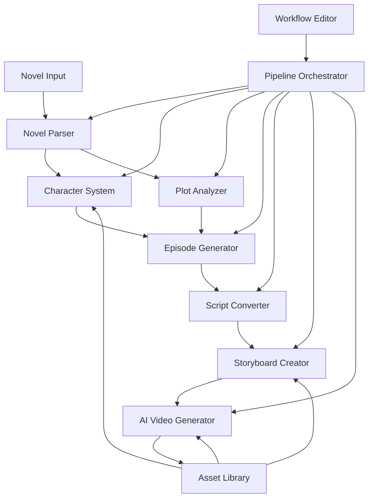

# Design Document

## Overview

The Novel-to-Anime Video Generator is a sophisticated AI-powered system that transforms complete novels into serialized animated short videos. The system employs a multi-stage pipeline architecture that preserves narrative integrity while adapting content for modern short-video platforms. The design emphasizes character consistency, plot fidelity, and production efficiency through automated workflows and intelligent asset management.

## Architecture

The system follows a microservices architecture with distinct processing stages connected through a central workflow orchestrator. Each component operates independently while sharing data through a common asset repository and state management system.



## Components and Interfaces

### Novel Parser
**Purpose:** Analyzes and structures raw novel text for downstream processing.

**Key Interfaces:**
- `parseNovel(textContent: string): NovelStructure`
- `extractChapters(structure: NovelStructure): Chapter[]`
- `validateFormat(file: File): ValidationResult`

**Implementation:** Uses NLP libraries (spaCy, NLTK) for text analysis, regular expressions for structural parsing, and machine learning models for content classification.

### Character System
**Purpose:** Identifies, tracks, and maintains character consistency across all generated content.

**Key Interfaces:**
- `identifyCharacters(chapters: Chapter[]): Character[]`
- `lockCharacterAttributes(character: Character): LockedProfile`
- `validateConsistency(content: any, profiles: LockedProfile[]): ConsistencyReport`

**Implementation:** Employs named entity recognition (NER), coreference resolution, and character relationship mapping. Maintains a character database with locked attributes and validation rules.

### Plot Analyzer
**Purpose:** Extracts and preserves the main storyline structure and critical plot points.

**Key Interfaces:**
- `extractMainPlot(chapters: Chapter[]): PlotStructure`
- `identifyKeyEvents(plot: PlotStructure): KeyEvent[]`
- `validatePlotIntegrity(episodes: Episode[]): IntegrityReport`

**Implementation:** Uses narrative analysis algorithms, sentiment tracking, and dramatic structure recognition to identify and preserve essential story elements.

### Episode Generator
**Purpose:** Divides novel content into episodic format suitable for short video platforms.

**Key Interfaces:**
- `generateEpisodes(plot: PlotStructure, characters: Character[]): Episode[]`
- `optimizePacing(episodes: Episode[]): Episode[]`
- `createEpisodeSummaries(episodes: Episode[]): Summary[]`

**Implementation:** Applies dramatic structure templates, pacing algorithms, and content compression techniques while maintaining narrative coherence.

### Script Converter
**Purpose:** Transforms narrative prose into screenplay format with detailed scene descriptions.

**Key Interfaces:**
- `convertToScript(episode: Episode): Screenplay`
- `extractDialogue(narrative: string): DialogueBlock[]`
- `generateSceneDescriptions(narrative: string): SceneDescription[]`

**Implementation:** Uses text classification to separate dialogue from narration, natural language generation for scene descriptions, and screenplay formatting standards.

### Storyboard Creator
**Purpose:** Generates detailed shot-by-shot visual descriptions for AI video generation.

**Key Interfaces:**
- `createStoryboard(screenplay: Screenplay): Storyboard`
- `generateShotSpecs(scene: Scene): ShotSpecification[]`
- `optimizeTransitions(shots: ShotSpecification[]): ShotSpecification[]`

**Implementation:** Applies cinematography rules, shot composition guidelines, and visual storytelling principles to create detailed production specifications.

### AI Video Generator
**Purpose:** Creates animated video content based on storyboard specifications.

**Key Interfaces:**
- `generateVideoSegment(shotSpec: ShotSpecification): VideoSegment`
- `combineSegments(segments: VideoSegment[]): Video`
- `applyTransitions(video: Video): Video`

**Implementation:** Integrates with AI video generation APIs (RunwayML, Pika Labs), implements character consistency mechanisms, and provides video post-processing capabilities.

### Workflow Editor
**Purpose:** Provides visual interface for pipeline management and customization.

**Key Interfaces:**
- `renderPipeline(workflow: WorkflowDefinition): VisualPipeline`
- `updateNodeConfiguration(nodeId: string, config: NodeConfig): void`
- `monitorProgress(pipelineId: string): ProgressStatus`

**Implementation:** Built as a web-based visual editor with drag-and-drop functionality, real-time status updates, and configuration management.

### Asset Library
**Purpose:** Manages and provides access to reusable visual and narrative assets.

**Key Interfaces:**
- `storeAsset(asset: Asset): AssetId`
- `retrieveAsset(id: AssetId): Asset`
- `searchAssets(criteria: SearchCriteria): Asset[]`

**Implementation:** Uses a document database for flexible asset storage, implements versioning and tagging systems, and provides efficient search and retrieval mechanisms.

### User Interface
**Purpose:** Provides the main application interface following Kiro's organizational structure and design patterns.

**Key Interfaces:**
- `initializePanelLayout(): PanelLayout`
- `showCommandPalette(): CommandPalette`
- `updateProgressStatus(status: ProgressStatus): void`
- `displayNotification(message: NotificationMessage): void`

**Implementation:** Built using web technologies with Kiro's design system, implements dockable panels, command palette functionality, and consistent visual styling throughout the application.

## Data Models

### NovelStructure
```typescript
interface NovelStructure {
  title: string;
  author: string;
  chapters: Chapter[];
  metadata: NovelMetadata;
}

interface Chapter {
  id: string;
  title: string;
  content: string;
  wordCount: number;
  scenes: Scene[];
}
```

### Character
```typescript
interface Character {
  id: string;
  name: string;
  role: 'protagonist' | 'antagonist' | 'supporting' | 'minor';
  attributes: CharacterAttributes;
  relationships: Relationship[];
  appearances: Appearance[];
}

interface LockedProfile {
  characterId: string;
  lockedAttributes: CharacterAttributes;
  visualReference: ImageReference;
  consistencyRules: ValidationRule[];
}
```

### Episode
```typescript
interface Episode {
  id: string;
  episodeNumber: number;
  title: string;
  summary: string;
  scenes: Scene[];
  duration: number;
  keyEvents: KeyEvent[];
}
```

### Storyboard
```typescript
interface Storyboard {
  episodeId: string;
  shots: ShotSpecification[];
  totalDuration: number;
  transitionSpecs: TransitionSpecification[];
}

interface ShotSpecification {
  shotId: string;
  duration: number;
  cameraAngle: CameraAngle;
  shotType: ShotType;
  characters: CharacterInShot[];
  setting: Setting;
  visualDescription: string;
  aiPrompt: string;
}
```

## Correctness Properties

*A property is a characteristic or behavior that should hold true across all valid executions of a system-essentially, a formal statement about what the system should do. Properties serve as the bridge between human-readable specifications and machine-verifiable correctness guarantees.*

Based on the prework analysis, the following properties have been identified after eliminating redundancy:

**Property 1: File validation consistency**
*For any* uploaded file, the Novel_Parser should correctly identify valid TXT files and reject invalid files with appropriate error messages
**Validates: Requirements 1.1, 1.4**

**Property 2: Chapter boundary detection**
*For any* novel text with chapter markers, the Novel_Parser should correctly identify all chapter boundaries regardless of the specific formatting pattern used
**Validates: Requirements 1.2**

**Property 3: Data persistence round-trip**
*For any* parsed novel structure, storing and then retrieving the content should yield an equivalent structure
**Validates: Requirements 1.3**

**Property 4: Character identification completeness**
*For any* novel, the Character_System should identify all characters that appear in multiple scenes or have significant narrative roles
**Validates: Requirements 2.1**

**Property 5: Character profile completeness**
*For any* identified character, the created profile should contain all required attributes (appearance, personality, relationships) and be properly locked against modification
**Validates: Requirements 2.2**

**Property 6: Character consistency enforcement**
*For any* character across multiple video generation calls, the visual and behavioral attributes should remain consistent with the locked profile
**Validates: Requirements 2.3, 2.4**

**Property 7: Character network integration**
*For any* new character introduced in later chapters, the Character_System should integrate them without disrupting existing character relationships
**Validates: Requirements 2.5**

**Property 8: Plot structure preservation**
*For any* novel, the main storyline structure and key plot points identified by the Plot_Analyzer should be preserved throughout all subsequent processing stages
**Validates: Requirements 3.1, 3.2, 3.3**

**Property 9: Source material fidelity priority**
*For any* conflict between video format constraints and plot fidelity, the system should prioritize preserving the original story elements
**Validates: Requirements 3.4, 3.5**

**Property 10: Episode structure completeness**
*For any* generated episode, it should contain appropriate length, complete dramatic arc, and maintain continuity with adjacent episodes
**Validates: Requirements 4.1, 4.2, 4.3**

**Property 11: Essential story element preservation**
*For any* pacing adjustments during episode generation, all essential story elements should be preserved in the final output
**Validates: Requirements 4.4, 4.5**

**Property 12: Screenplay format completeness**
*For any* episode converted to screenplay format, the output should contain all required elements (dialogue, action, scene descriptions) with proper formatting
**Validates: Requirements 5.1, 5.3, 5.5**

**Property 13: Character voice consistency**
*For any* character's dialogue across different scenes, the voice patterns and speaking style should remain consistent with the character's established profile
**Validates: Requirements 5.2**

**Property 14: Emotional translation accuracy**
*For any* identified emotional beat in the narrative, the Script_Converter should produce actionable visual direction that accurately represents the emotional content
**Validates: Requirements 5.4**

**Property 15: Storyboard completeness and consistency**
*For any* screenplay scene, the generated storyboard should include complete shot specifications and maintain character visual consistency with locked profiles
**Validates: Requirements 6.1, 6.2, 6.3**

**Property 16: Transition smoothness**
*For any* sequence of storyboard shots, the transition specifications should enable smooth video continuity
**Validates: Requirements 6.4**

**Property 17: AI generation compatibility**
*For any* completed storyboard, the output format should be structured correctly for AI video generation systems
**Validates: Requirements 6.5**

**Property 18: Video generation accuracy**
*For any* storyboard specification, the generated video segments should match the visual descriptions and maintain character design consistency
**Validates: Requirements 7.1, 7.2**

**Property 19: Visual style coherence**
*For any* video content generated for a project, the artistic style and visual elements should remain coherent throughout
**Validates: Requirements 7.3, 7.4**

**Property 20: Error reporting completeness**
*For any* error condition in video generation, the system should provide detailed error reports with actionable correction suggestions
**Validates: Requirements 7.5**

**Property 21: Workflow editor functionality**
*For any* user interaction with the workflow editor, the system should provide appropriate configuration options, progress updates, and error visualization
**Validates: Requirements 8.2, 8.3, 8.4, 8.5**

**Property 22: Asset library completeness**
*For any* created asset (character profile, scene template), all components should be properly stored with appropriate metadata for search and retrieval
**Validates: Requirements 9.1, 9.2**

**Property 23: Asset search accuracy**
*For any* search query in the asset library, the results should match the specified criteria and be properly filtered by type, project, and characteristics
**Validates: Requirements 9.3**

**Property 24: Asset version control**
*For any* asset modification, the system should maintain complete version history and enable rollback to any previous version
**Validates: Requirements 9.4**

**Property 25: Cross-project asset sharing**
*For any* asset marked for sharing, it should be accessible and synchronizable across different projects
**Validates: Requirements 9.5**

**Property 26: Visual element caching**
*For any* common visual element used in video generation, the system should cache and reuse it appropriately to improve efficiency
**Validates: Requirements 10.3**

**Property 27: Process control reliability**
*For any* long-running process, pause, resume, and cancel operations should work correctly without data loss
**Validates: Requirements 10.5**

**Property 28: Kiro UI consistency**
*For any* UI component or interaction pattern, the interface should follow Kiro's design language and organizational structure
**Validates: Requirements 11.1, 11.2, 11.3, 11.4, 11.5**

## Error Handling

The system implements comprehensive error handling across all components:

**Input Validation Errors:**
- Invalid file formats are rejected with specific error messages
- Malformed novel structures trigger parsing errors with line-specific feedback
- Character profile inconsistencies generate validation warnings

**Processing Errors:**
- AI service failures trigger automatic retry mechanisms with exponential backoff
- Resource exhaustion errors activate quality reduction and caching strategies
- Pipeline failures provide detailed diagnostic information and recovery suggestions

**Data Integrity Errors:**
- Character consistency violations halt processing with specific conflict reports
- Plot integrity failures provide detailed analysis of missing or modified elements
- Asset corruption triggers automatic rollback to last known good version

**User Interface Errors:**
- Configuration validation errors provide immediate feedback with correction suggestions
- Network connectivity issues display appropriate status messages and retry options
- Workflow editor errors highlight problematic nodes with diagnostic information

## Testing Strategy

The system employs a dual testing approach combining unit testing and property-based testing to ensure comprehensive coverage and correctness validation.

**Unit Testing Approach:**
- Unit tests verify specific examples, edge cases, and error conditions
- Integration tests validate component interactions and data flow
- UI tests ensure proper user interface behavior and error handling
- Unit tests focus on concrete scenarios and specific implementation details

**Property-Based Testing Approach:**
- Property tests verify universal properties that should hold across all inputs using **fast-check** as the property-based testing library
- Each property-based test runs a minimum of 100 iterations to ensure statistical confidence
- Property tests use intelligent generators that create realistic test data within appropriate constraints
- Each property-based test is tagged with comments explicitly referencing the correctness property from this design document

**Property-Based Testing Requirements:**
- All property-based tests must be tagged using the format: '**Feature: novel-anime-generator, Property {number}: {property_text}**'
- Each correctness property must be implemented by a single property-based test
- Property tests must run at least 100 iterations to ensure adequate coverage
- Test generators must create realistic data that reflects actual usage patterns

**Testing Coverage:**
- Unit tests handle specific examples, integration points, and error conditions
- Property tests verify general correctness across all possible inputs
- Together, both approaches provide comprehensive coverage: unit tests catch concrete bugs while property tests verify universal correctness

The combination of unit and property-based testing ensures both specific functionality and general system correctness are thoroughly validated.

Now I need to complete the prework analysis before writing the Correctness Properties section:

<function_calls>
<invoke name="prework">
<parameter name="featureName">novel-anime-generator