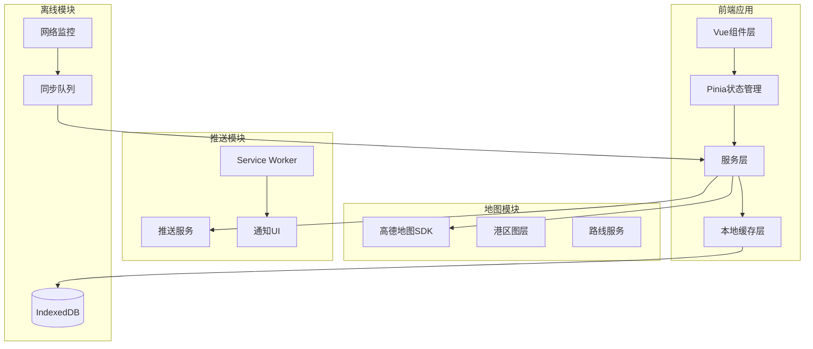
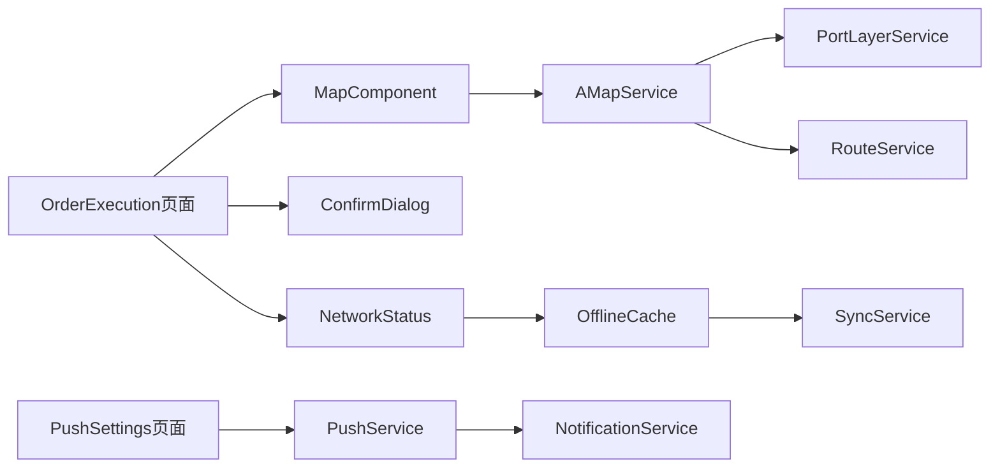

# Design Document - Phase 4 Advanced Features

## Overview

本设计文档定义了上海港集装箱运输供需系统 Phase 4 高级功能的技术架构和实现方案。Phase 4 包含三个核心模块：

1. **地图集成** - 高德地图SDK集成，提供路线规划、实时导航和港区专属图层
2. **推送系统** - 基于司机条件的智能订单推送，包括推送设置和历史记录
3. **异常状态处理** - 网络异常处理、本地缓存、二次确认和错误提示优化

### 技术栈
- **前端框架**: Vue 3.5 + Quasar 2.18 + TypeScript
- **地图SDK**: 高德地图 JS API 2.0
- **状态管理**: Pinia 3.x
- **本地存储**: IndexedDB (via Dexie.js)
- **推送服务**: Web Push API + Service Worker

## Architecture

### 系统架构图



### 模块依赖关系



## Components and Interfaces

### 1. 地图组件 (AMapContainer.vue)

```typescript
interface AMapContainerProps {
  center?: [number, number]      // 地图中心点 [lng, lat]
  zoom?: number                  // 缩放级别 (3-18)
  showPortLayer?: boolean        // 是否显示港区图层
  markers?: MapMarker[]          // 标记点列表
  route?: RouteInfo              // 路线信息
  onMapReady?: () => void        // 地图加载完成回调
  onMarkerClick?: (marker: MapMarker) => void
  onRouteComplete?: (route: RouteResult) => void
}

interface MapMarker {
  id: string
  position: [number, number]     // [lng, lat]
  type: 'origin' | 'destination' | 'waypoint' | 'poi'
  icon?: string
  title?: string
  content?: string
}

interface RouteInfo {
  origin: [number, number]
  destination: [number, number]
  waypoints?: [number, number][]
  avoidHighway?: boolean
  avoidToll?: boolean
  truckRestrictions?: {
    height?: number              // 限高(米)
    weight?: number              // 限重(吨)
  }
}

interface RouteResult {
  distance: number               // 距离(米)
  duration: number               // 时长(秒)
  polyline: [number, number][]   // 路线坐标点
  steps: RouteStep[]
}
```

### 2. 港区图层服务 (PortLayerService)

```typescript
interface PortPOI {
  id: string
  name: string
  type: 'terminal' | 'gate' | 'parking' | 'checkpoint'
  position: [number, number]
  address: string
  status?: 'open' | 'closed' | 'busy'
  details?: {
    operatingHours?: string
    capacity?: number
    availableSpots?: number
    restrictions?: string[]
  }
}

interface PortLayerService {
  loadPortLayer(portCode: string): Promise<PortPOI[]>
  getTerminals(): PortPOI[]
  getGates(): PortPOI[]
  getParkingLots(): PortPOI[]
  getPOIDetails(poiId: string): Promise<PortPOI>
}
```

### 3. 推送服务 (PushService)

```typescript
interface PushSettings {
  enabled: boolean
  distanceRange: number          // 推送距离范围(km)
  vehicleTypes: string[]         // 接收的车型
  soundEnabled: boolean
  vibrationEnabled: boolean
}

interface PushNotification {
  id: string
  orderId: string
  title: string
  body: string
  timestamp: string
  read: boolean
  data: {
    route: string
    freight: number
    distance: number
  }
}

interface PushService {
  // 设置管理
  getSettings(): Promise<PushSettings>
  updateSettings(settings: Partial<PushSettings>): Promise<void>
  
  // 推送控制
  subscribe(): Promise<void>
  unsubscribe(): Promise<void>
  
  // 历史记录
  getHistory(days?: number): Promise<PushNotification[]>
  markAsRead(notificationId: string): Promise<void>
  clearHistory(): Promise<void>
}
```

### 4. 离线缓存服务 (OfflineCacheService)

```typescript
interface CachedRequest {
  id: string
  url: string
  method: 'POST' | 'PUT' | 'DELETE'
  body: any
  timestamp: string
  retryCount: number
  status: 'pending' | 'syncing' | 'failed'
}

interface OfflineCacheService {
  // 缓存操作
  cacheRequest(request: Omit<CachedRequest, 'id' | 'timestamp' | 'retryCount' | 'status'>): Promise<string>
  getCachedRequests(): Promise<CachedRequest[]>
  removeCachedRequest(id: string): Promise<void>
  
  // 同步操作
  syncAll(): Promise<SyncResult>
  syncOne(id: string): Promise<boolean>
  
  // 网络状态
  isOnline(): boolean
  onNetworkChange(callback: (online: boolean) => void): void
}

interface SyncResult {
  total: number
  success: number
  failed: number
  failedIds: string[]
}
```

### 5. 确认弹窗组件 (ConfirmDialog.vue)

```typescript
interface ConfirmDialogProps {
  visible: boolean
  title: string
  message: string
  type: 'info' | 'warning' | 'danger'
  confirmText?: string
  cancelText?: string
  showCancel?: boolean
  details?: Array<{ label: string; value: string }>
  consequences?: string[]        // 操作后果说明
  onConfirm: () => void | Promise<void>
  onCancel?: () => void
}
```

### 6. 网络状态组件 (NetworkStatus.vue)

```typescript
interface NetworkStatusProps {
  showWhenOnline?: boolean
  position?: 'top' | 'bottom'
  autoHide?: boolean
  autoHideDelay?: number
}

interface NetworkStatusEmits {
  (e: 'online'): void
  (e: 'offline'): void
  (e: 'sync-start'): void
  (e: 'sync-complete', result: SyncResult): void
}
```

## Data Models

### 地图相关数据模型

```typescript
// 上海港区配置
const SHANGHAI_PORT_CONFIG = {
  center: [121.8, 30.9] as [number, number],
  zoom: 11,
  bounds: {
    southwest: [121.4, 30.6],
    northeast: [122.2, 31.2]
  },
  terminals: [
    { code: 'YSG', name: '洋山港', position: [122.0, 30.6] },
    { code: 'WGQ', name: '外高桥', position: [121.6, 31.3] },
    { code: 'WS', name: '吴淞', position: [121.5, 31.4] }
  ]
}

// 集卡限制配置
const TRUCK_RESTRICTIONS = {
  maxHeight: 4.5,                // 最大限高(米)
  maxWeight: 49,                 // 最大限重(吨)
  restrictedAreas: [
    { name: '外环隧道', type: 'height', limit: 4.2 },
    { name: '长江隧道', type: 'height', limit: 4.5 }
  ]
}
```

### 推送相关数据模型

```typescript
// IndexedDB Schema (Dexie)
interface PushHistoryRecord {
  id?: number
  notificationId: string
  orderId: string
  title: string
  body: string
  timestamp: Date
  read: boolean
  data: any
}

// 推送筛选规则
interface PushFilterRule {
  driverId: string
  vehicleType: string
  hasShPlate: boolean
  currentLocation: [number, number]
  distanceRange: number
}
```

### 离线缓存数据模型

```typescript
// IndexedDB Schema
interface OfflineRequestRecord {
  id?: number
  requestId: string
  url: string
  method: string
  body: string                   // JSON stringified
  headers: Record<string, string>
  timestamp: Date
  retryCount: number
  lastError?: string
  status: 'pending' | 'syncing' | 'failed'
}
```

## Correctness Properties

*A property is a characteristic or behavior that should hold true across all valid executions of a system-essentially, a formal statement about what the system should do. Properties serve as the bridge between human-readable specifications and machine-verifiable correctness guarantees.*

### Property 1: Route planning respects truck restrictions
*For any* route planning request with truck restrictions (height/weight limits), the returned route should avoid all restricted areas that exceed the specified limits.
**Validates: Requirements 1.4**

### Property 2: Port layer contains required POI types
*For any* port layer load request, the returned POI list should contain at least one terminal, one gate, and one parking lot for the specified port.
**Validates: Requirements 2.1, 2.2, 2.3**

### Property 3: Push filtering by vehicle type
*For any* order with specific vehicle type requirements and any driver, the order should only be pushed to drivers whose vehicle type matches the requirement.
**Validates: Requirements 3.1**

### Property 4: Push filtering by plate type
*For any* order requiring Shanghai plate (沪牌) and any driver, the order should only be pushed to drivers who have Shanghai plates.
**Validates: Requirements 3.2**

### Property 5: Push filtering by distance
*For any* order and any driver with push enabled, the order should only be pushed if the distance between the driver's location and the order's origin is within the driver's configured distance range (default 50km).
**Validates: Requirements 3.3, 4.3**

### Property 6: Push settings persistence
*For any* push settings update, reading the settings immediately after should return the updated values.
**Validates: Requirements 4.2**

### Property 7: Push history time range
*For any* push history query with a specified day range, all returned records should have timestamps within that range.
**Validates: Requirements 4.4**

### Property 8: Offline cache round-trip
*For any* request cached during offline mode, the cached request should be retrievable with identical URL, method, and body.
**Validates: Requirements 5.2**

### Property 9: Sync clears successful cache
*For any* cached request that syncs successfully, the cache should no longer contain that request after sync completion.
**Validates: Requirements 5.4**

### Property 10: Sync preserves failed cache
*For any* cached request that fails to sync, the cache should still contain that request after sync attempt.
**Validates: Requirements 5.5**

### Property 11: Confirm dialog shows order details
*For any* grab order confirmation dialog, the dialog content should include the order's route, freight, and container type.
**Validates: Requirements 6.1**

### Property 12: Confirm cancel preserves state
*For any* confirmation dialog where user clicks cancel, the underlying state should remain unchanged.
**Validates: Requirements 6.4**

### Property 13: API error messages are specific
*For any* API error response with an error code, the displayed error message should be different from the generic "操作失败" message.
**Validates: Requirements 7.1**

### Property 14: Form validation highlights errors
*For any* form submission with invalid fields, all invalid fields should be marked with error state and have non-empty error messages.
**Validates: Requirements 7.2**

## Error Handling

### 地图错误处理

| 错误类型 | 错误码 | 处理方式 |
|---------|--------|---------|
| SDK加载失败 | MAP_LOAD_ERROR | 显示错误提示，提供重试按钮 |
| 定位失败 | LOCATION_ERROR | 使用默认位置，提示用户手动选择 |
| 路线规划失败 | ROUTE_ERROR | 显示错误原因，建议检查网络 |
| 图层加载失败 | LAYER_ERROR | 降级显示基础地图 |

### 推送错误处理

| 错误类型 | 错误码 | 处理方式 |
|---------|--------|---------|
| 推送权限被拒 | PUSH_DENIED | 引导用户开启通知权限 |
| 订阅失败 | SUBSCRIBE_ERROR | 重试3次后提示手动刷新 |
| 通知发送失败 | NOTIFY_ERROR | 静默失败，记录日志 |

### 离线缓存错误处理

| 错误类型 | 错误码 | 处理方式 |
|---------|--------|---------|
| 存储空间不足 | STORAGE_FULL | 清理旧缓存，提示用户 |
| 同步冲突 | SYNC_CONFLICT | 保留服务器版本，提示用户 |
| 同步超时 | SYNC_TIMEOUT | 保留缓存，稍后重试 |

### 错误消息映射

```typescript
const ERROR_MESSAGES: Record<string, string> = {
  // 网络错误
  'NETWORK_ERROR': '网络连接失败，请检查网络设置',
  'TIMEOUT': '请求超时，请稍后重试',
  
  // 业务错误
  'ORDER_GRABBED': '该订单已被其他司机抢走',
  'ORDER_EXPIRED': '订单已过期，无法抢单',
  'INSUFFICIENT_BALANCE': '余额不足，请先充值',
  'INVALID_PLATE': '您的车牌不符合该订单要求',
  
  // 验证错误
  'INVALID_CONTAINER_NUMBER': '集装箱号格式错误，应为4位字母+7位数字',
  'INVALID_SEAL_NUMBER': '铅封号不能为空',
  'PHOTO_REQUIRED': '请上传集装箱照片',
  
  // 默认错误
  'UNKNOWN': '操作失败，请稍后重试'
}
```

## Testing Strategy

### 单元测试

使用 Vitest 进行单元测试，覆盖以下模块：

1. **服务层测试**
   - PortLayerService: POI数据加载和过滤
   - PushService: 设置管理和历史记录
   - OfflineCacheService: 缓存CRUD操作

2. **工具函数测试**
   - 距离计算函数
   - 错误消息映射函数
   - 数据格式化函数

### 属性测试

使用 fast-check 进行属性测试，每个属性测试运行至少100次迭代。

```typescript
// 测试框架配置
import fc from 'fast-check'

// 属性测试示例结构
describe('Push Filtering Properties', () => {
  it('Property 4: Push filtering by plate type', () => {
    fc.assert(
      fc.property(
        orderArbitrary,
        driverArbitrary,
        (order, driver) => {
          // **Feature: phase4-advanced-features, Property 4: Push filtering by plate type**
          if (order.requiresShPlate && !driver.hasShPlate) {
            return !shouldPushToDriver(order, driver)
          }
          return true
        }
      ),
      { numRuns: 100 }
    )
  })
})
```

### 集成测试

1. **地图集成测试**
   - 地图组件渲染测试
   - 路线规划API调用测试
   - 港区图层加载测试

2. **推送集成测试**
   - Service Worker注册测试
   - 通知权限请求测试
   - 推送接收和显示测试

3. **离线功能测试**
   - 网络状态切换测试
   - 缓存存储和读取测试
   - 自动同步测试

### 测试数据生成器

```typescript
// 订单数据生成器
const orderArbitrary = fc.record({
  listingId: fc.uuid(),
  requiresShPlate: fc.boolean(),
  vehicleType: fc.constantFrom('20GP', '40GP', '40HQ'),
  originPort: fc.constantFrom('洋山港', '外高桥', '吴淞'),
  freight: fc.integer({ min: 500, max: 5000 }),
  distance: fc.float({ min: 1, max: 200 })
})

// 司机数据生成器
const driverArbitrary = fc.record({
  driverId: fc.uuid(),
  hasShPlate: fc.boolean(),
  vehicleType: fc.constantFrom('20GP', '40GP', '40HQ'),
  currentLocation: fc.tuple(
    fc.float({ min: 121.0, max: 122.5 }),
    fc.float({ min: 30.5, max: 31.5 })
  ),
  pushSettings: fc.record({
    enabled: fc.boolean(),
    distanceRange: fc.integer({ min: 10, max: 100 })
  })
})
```
