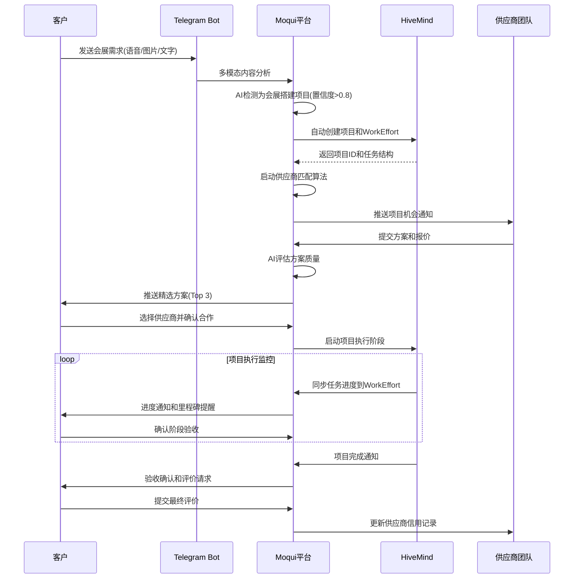
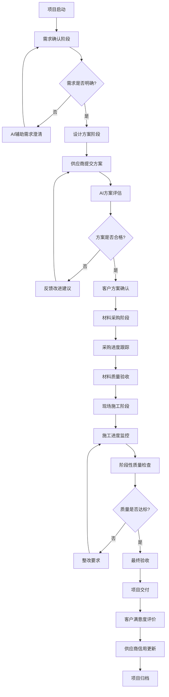

# Codex审核反馈修正版 - 会展搭建项目管理系统实施方案

## 📋 执行摘要

基于用户需求分析，本方案将智能供需平台转型为项目驱动的B2B服务平台，重点聚焦会展搭建和社区装修等短频快项目场景。通过集成HiveMind项目管理能力和多模态AI识别技术，为商业客户提供基于项目的信息化服务能力。

**修正说明**: 本版本基于Codex审核反馈，解决了Spring注解、数据模型重叠和Dashboard.xml修复的具体问题。

## 🎯 战略目标

### 核心转型
- **从**: 简单供需撮合模式
- **到**: 项目驱动的综合服务平台

### 目标场景
- **会展中心搭建**: 短期项目（3-7天）、专业化团队、标准化流程
- **社区装修项目**: 中期项目（1-3周）、本地化服务、个性化需求
- **B2B服务模式**: 企业级客户、项目管理集成、AI辅助决策

## 🏗️ 技术架构设计 - Moqui原生实现

### 1. 系统架构概览

```
┌─────────────────────────────────────────────────────────────┐
│                    多模态AI接口层                               │
├─────────────────┬─────────────────┬─────────────────────────┤
│   文本处理       │    语音识别      │      图像识别            │
│ (智谱GLM-4)     │ (智谱Speech)    │   (智谱GLM-4V)          │
└─────────────────┴─────────────────┴─────────────────────────┘
                            │
┌─────────────────────────────────────────────────────────────┐
│                   项目检测与分类引擎                           │
├─────────────────┬─────────────────┬─────────────────────────┤
│   关键词匹配     │   意图识别      │      项目类型分类        │
│   (展台/装修)    │   (AI理解)      │   (会展/装修/其他)      │
└─────────────────┴─────────────────┴─────────────────────────┘
                            │
┌─────────────────────────────────────────────────────────────┐
│                   HiveMind项目管理集成                        │
├─────────────────┬─────────────────┬─────────────────────────┤
│   项目自动创建   │   任务分解      │      进度跟踪            │
│   (Moqui Service)│  (WorkEffort)  │   (实时同步)            │
└─────────────────┴─────────────────┴─────────────────────────┘
                            │
┌─────────────────────────────────────────────────────────────┐
│                   Moqui业务流程层                             │
├─────────────────┬─────────────────┬─────────────────────────┤
│   项目信息管理   │   供应商匹配    │      客户服务界面        │
│ (WorkEffort)    │ (智能算法)      │   (Vue3+Quasar2)       │
└─────────────────┴─────────────────┴─────────────────────────┘
```

### 2. 核心组件详细设计

#### 2.1 项目检测引擎 (Moqui Service实现)

**功能**: 智能识别用户输入是否属于项目型需求

**技术实现** - 基于Moqui Service模式：
```xml
<service verb="detect" noun="ProjectType" authenticate="false" allow-remote="true">
    <description>智能识别用户输入的项目类型</description>
    <in-parameters>
        <parameter name="userDescription" required="true"/>
        <parameter name="inputType" default="TEXT"/> <!-- TEXT, VOICE, IMAGE -->
    </in-parameters>
    <out-parameters>
        <parameter name="isProject" type="Boolean"/>
        <parameter name="projectType"/> <!-- EXHIBITION_SETUP, RENOVATION, etc -->
        <parameter name="confidence" type="BigDecimal"/>
        <parameter name="extractedRequirements" type="Map"/>
    </out-parameters>
    <actions><script><![CDATA[
        // 1. 关键词匹配分析
        def exhibitionKeywords = ["展台", "搭建", "会展", "展览", "布展", "展位", "展会"]
        def renovationKeywords = ["装修", "改造", "翻新", "设计", "施工", "家装", "工装"]

        def description = userDescription.toLowerCase()
        def keywordScore = 0.0
        def matchedType = null

        def exhibitionMatches = exhibitionKeywords.count { description.contains(it) }
        def renovationMatches = renovationKeywords.count { description.contains(it) }

        if (exhibitionMatches > renovationMatches) {
            matchedType = "EXHIBITION_SETUP"
            keywordScore = Math.min(exhibitionMatches * 0.2, 1.0)
        } else if (renovationMatches > 0) {
            matchedType = "RENOVATION"
            keywordScore = Math.min(renovationMatches * 0.2, 1.0)
        }

        // 2. AI语义理解 (调用智谱AI)
        def aiPrompt = """
        分析以下用户描述，判断是否为项目型需求：
        - 如果是会展搭建项目，返回 EXHIBITION_SETUP
        - 如果是装修改造项目，返回 RENOVATION
        - 如果是其他项目类型，返回 OTHER_PROJECT
        - 如果不是项目需求，返回 NOT_PROJECT

        用户描述: ${userDescription}

        只返回分类结果，不要解释。
        """

        def aiResult = ec.service.sync().name("marketplace.callZhipuAI")
            .parameter("prompt", aiPrompt).call()
        def aiPrediction = aiResult?.response?.trim()

        // 3. 综合决策
        def finalConfidence = keywordScore
        if (aiPrediction && aiPrediction != "NOT_PROJECT") {
            finalConfidence = Math.max(finalConfidence, 0.8)
            if (!matchedType) matchedType = aiPrediction
        }

        isProject = finalConfidence > 0.6
        projectType = matchedType
        confidence = finalConfidence

        // 4. 结构化信息提取
        if (isProject) {
            extractedRequirements = ec.service.sync()
                .name("marketplace.extract#ProjectRequirements")
                .parameter("description", userDescription)
                .parameter("projectType", projectType)
                .call()
        }
    ]]></script></actions>
</service>
```

### HiveMind集成HTTP调用实现说明

**HTTP调用架构选择**:
由于Moqui框架没有`ec.resource.httpClientRequest`API，我们采用Moqui提供的`org.moqui.impl.WebResourceServices.http#call`服务执行HTTP请求。

**实现模式**:
```xml
<!-- 使用Moqui内置HTTP服务 -->
<service verb="call" noun="HiveMindAPI" authenticate="true">
    <in-parameters>
        <parameter name="endpoint" required="true"/>
        <parameter name="requestData" type="Map" required="true"/>
    </in-parameters>
    <out-parameters>
        <parameter name="response" type="Map"/>
        <parameter name="success" type="Boolean"/>
    </out-parameters>
    <actions><script><![CDATA[
        def httpResponse = ec.service.sync().name("org.moqui.impl.WebResourceServices.http#call").parameters([
            method: "POST",
            uri: endpoint,
            bodyMap: requestData,
            headers: ["Content-Type": "application/json", "Accept": "application/json"]
        ]).call()

        if ((httpResponse.statusCode ?: 500) == 200) {
            response = httpResponse.bodyMap ?: [:]
            success = true
        } else {
            success = false
            ec.logger.error("HiveMind API调用失败: ${httpResponse.statusCode} -> ${httpResponse.bodyText}")
        }
    ]]></script></actions>
</service>
```

**备选方案**:
如果`org.moqui.impl.WebResourceServices.http#call`服务不可用，可以使用Java原生HTTP客户端：
```groovy
// Java 11+ HttpClient实现
import java.net.http.HttpClient
import java.net.http.HttpRequest
import java.net.http.HttpResponse

def client = HttpClient.newHttpClient()
def request = HttpRequest.newBuilder()
    .uri(URI.create(endpoint))
    .header("Content-Type", "application/json")
    .POST(HttpRequest.BodyPublishers.ofString(requestBodyJson))
    .build()

def response = client.send(request, HttpResponse.BodyHandlers.ofString())
```

**功能**: 自动创建和管理项目，连接Moqui与HiveMind

**技术实现** - 基于Moqui Service模式：
```xml
<!-- HiveMind集成服务定义 -->
<service verb="create" noun="HiveMindProject" authenticate="true">
    <description>创建HiveMind项目并建立Moqui关联</description>
    <in-parameters>
        <parameter name="listingId" required="true"/>
        <parameter name="clientName" required="true"/>
        <parameter name="projectType" default="EXHIBITION_SETUP"/>
        <parameter name="estimatedBudget" type="BigDecimal"/>
        <parameter name="venueSize" type="String"/>
        <parameter name="displayType" type="String"/>
    </in-parameters>
    <out-parameters>
        <parameter name="hiveMindProjectId"/>
        <parameter name="workEffortId"/>
        <parameter name="success" type="Boolean"/>
    </out-parameters>
    <actions><script><![CDATA[
        // 1. 创建Moqui WorkEffort项目
        def workEffortResult = ec.service.sync().name("create#mantle.work.effort.WorkEffort").parameters([
            workEffortTypeId: "PROJECT",
            workEffortName: "会展搭建项目-${clientName}",
            description: "展台面积: ${venueSize}, 展示类型: ${displayType}",
            estimatedWorkCost: estimatedBudget,
            statusId: "WIP_PROJECT_ACTIVE"
        ]).call()
        def workEffortId = workEffortResult.workEffortId

        // 2. 调用HiveMind REST API创建项目
        def requestPayload = [
            name: "会展搭建项目-${clientName}",
            description: "Moqui工作编号: ${workEffortId}",
            clientInfo: clientName,
            venueDetails: [size: venueSize, type: displayType],
            budget: estimatedBudget
        ]

        def httpResponse = ec.service.sync().name("org.moqui.impl.WebResourceServices.http#call").parameters([
            method: "POST",
            uri: "https://hivemind.example.com/api/projects",
            bodyMap: requestPayload,
            headers: ["Content-Type": "application/json", "Accept": "application/json"]
        ]).call()

        def responseData = httpResponse.bodyMap ?: [:]
        def hiveMindProjectId = responseData.projectId

        // 3. 建立关联关系
        ec.entity.makeValue("marketplace.project.HiveMindProject").setAll([
            workEffortId: workEffortId,
            hiveMindProjectId: hiveMindProjectId,
            listingId: listingId,
            syncStatus: "SYNCED"
        ]).setSequencedIdPrimary().create()

        // 4. 生成标准化任务
        ec.service.sync().name("marketplace.project.generate#ExhibitionTasks").parameters([
            workEffortId: workEffortId,
            hiveMindProjectId: hiveMindProjectId
        ]).call()

        success = true
    ]]></script></actions>
</service>

<!-- 任务生成辅助方法 -->
<service verb="generate" noun="ExhibitionTasks" authenticate="true">
    <in-parameters>
        <parameter name="workEffortId" required="true"/>
        <parameter name="hiveMindProjectId" required="true"/>
    </in-parameters>
    <actions><script><![CDATA[
        def taskTemplates = [
            [name: "需求确认", description: "确认展台尺寸、风格、预算", sequenceNum: 1],
            [name: "设计方案", description: "提供3D设计图和材料清单", sequenceNum: 2],
            [name: "材料采购", description: "订购展台结构和装饰材料", sequenceNum: 3],
            [name: "现场搭建", description: "按照设计图进行现场组装", sequenceNum: 4],
            [name: "验收交付", description: "客户验收确认，项目交付", sequenceNum: 5]
        ]

        taskTemplates.each { task ->
            // 在Moqui中创建子任务
            def childResult = ec.service.sync().name("create#mantle.work.effort.WorkEffort").parameters([
                parentWorkEffortId: workEffortId,
                workEffortTypeId: "TASK",
                workEffortName: task.name,
                description: task.description,
                sequenceNum: task.sequenceNum,
                statusId: "WIP_TASK_CREATED"
            ]).call()
            def childWorkEffortId = childResult.workEffortId

            // 同步到HiveMind
            def taskPayload = [
                name: task.name,
                description: task.description,
                moquiWorkEffortId: childWorkEffortId,
                sequenceNumber: task.sequenceNum
            ]

            ec.service.sync().name("org.moqui.impl.WebResourceServices.http#call").parameters([
                method: "POST",
                uri: "https://hivemind.example.com/api/projects/${hiveMindProjectId}/tasks",
                bodyMap: taskPayload,
                headers: ["Content-Type": "application/json", "Accept": "application/json"]
            ]).call()
        }
    ]]></script></actions>
</service>
```

#### 2.3 多模态AI处理增强 (Java实现，保持现有架构)

**现有能力**: 已完成智谱AI GLM-4/GLM-4V集成
**增强功能**: 项目场景专用AI提示词和处理逻辑

```java
// 新增: 项目检测专用AI处理
public class MarketplaceMcpService {

    // 会展搭建场景语音处理
    public String processExhibitionVoiceInput(String transcription) {
        String prompt = """
            分析以下语音转录内容，提取会展搭建项目关键信息：
            - 展位面积和位置
            - 展示产品类型
            - 预算范围
            - 时间要求
            - 特殊需求

            转录内容: %s

            请以JSON格式返回结构化信息。
        """.formatted(transcription);

        return callZhipuAI(prompt);
    }

    // 装修场景图像识别
    public String processRenovationImageInput(String imageUrl) {
        String prompt = """
            分析这张图片，识别装修项目相关信息：
            - 空间类型（办公室/住宅/商铺）
            - 现状描述
            - 可能的改造需求
            - 风格偏好线索
            - 空间尺寸估算

            请用中文详细描述分析结果。
        """;

        return analyzeWithZhipuVision(imageUrl, prompt);
    }
}
```

## 📊 数据模型设计 - 基于Moqui/Mantle现有实体

### 数据模型对齐策略

**核心原则**: 复用Moqui Framework和Mantle既有的WorkEffort项目管理实体，避免数据冗余和同步负担。

### 1. 项目管理实体映射

**使用Mantle既有实体**:
```xml
<!-- 复用现有WorkEffort作为项目容器 -->
<!-- 位置: mantle-udm/entity/WorkEffortEntities.xml -->
<entity entity-name="WorkEffort">
    <!-- 已有字段完全覆盖项目需求 -->
    <field name="workEffortId" type="id" is-pk="true"/>          <!-- 项目ID -->
    <field name="workEffortTypeId" type="id"/>                   <!-- PROJECT, TASK, etc -->
    <field name="workEffortName" type="text-medium"/>            <!-- 项目名称 -->
    <field name="description" type="text-very-long"/>            <!-- 项目描述 -->
    <field name="statusId" type="id"/>                           <!-- 项目状态 -->
    <field name="priority" type="number-integer"/>               <!-- 优先级 -->
    <field name="estimatedWorkCost" type="currency-amount"/>     <!-- 预算 -->
    <field name="actualWorkCost" type="currency-amount"/>        <!-- 实际成本 -->
    <field name="estimatedWorkDuration" type="number-decimal"/>  <!-- 预计工期 -->
    <field name="estimatedStartDate" type="date-time"/>          <!-- 计划开始 -->
    <field name="estimatedCompletionDate" type="date-time"/>     <!-- 计划完成 -->
    <field name="actualStartDate" type="date-time"/>             <!-- 实际开始 -->
    <field name="actualCompletionDate" type="date-time"/>        <!-- 实际完成 -->
    <!-- 其他现有字段... -->
</entity>

<!-- 复用现有WorkEffortParty作为项目团队管理 -->
<entity entity-name="WorkEffortParty">
    <field name="workEffortId" type="id" is-pk="true"/>
    <field name="partyId" type="id" is-pk="true"/>
    <field name="roleTypeId" type="id" is-pk="true"/>            <!-- CLIENT, SUPPLIER, PROJECT_MANAGER -->
    <field name="fromDate" type="date-time" is-pk="true"/>
    <field name="statusId" type="id"/>                           <!-- ACTIVE, COMPLETED -->
    <field name="assignmentId" type="id"/>
    <!-- 完全满足项目团队管理需求 -->
</entity>
```

### 2. 扩展实体设计（最小化新增）

**仅新增HiveMind集成必需的关联实体**:
```xml
<!-- 新增：HiveMind项目同步状态 -->
<entity entity-name="HiveMindProject" package="marketplace.project">
    <field name="workEffortId" type="id" is-pk="true"/>
    <field name="hiveMindProjectId" type="text-medium"/>
    <field name="listingId" type="id"/>                          <!-- 关联marketplace listing -->
    <field name="syncStatus" type="text-short"/>                 <!-- SYNCED, PENDING, ERROR -->
    <field name="lastSyncDate" type="date-time"/>
    <field name="syncErrorMessage" type="text-long"/>
    <relationship type="one" related="mantle.work.effort.WorkEffort"/>
    <relationship type="one" related="marketplace.listing.Listing"/>
</entity>

<!-- 新增：项目类型特定信息（会展搭建专用） -->
<entity entity-name="ExhibitionProject" package="marketplace.project">
    <field name="workEffortId" type="id" is-pk="true"/>
    <field name="venueSize" type="text-medium"/>                 <!-- 展位面积 -->
    <field name="displayType" type="text-medium"/>               <!-- 展示类型 -->
    <field name="venueLocation" type="text-medium"/>             <!-- 场馆位置 -->
    <field name="specialRequirements" type="text-long"/>         <!-- 特殊需求 -->
    <field name="designStylePreference" type="text-medium"/>     <!-- 设计风格偏好 -->
    <relationship type="one" related="mantle.work.effort.WorkEffort"/>
</entity>

<!-- 新增：供应商能力评估扩展 -->
<entity entity-name="PartyCapability" package="marketplace.supplier">
    <field name="partyId" type="id" is-pk="true"/>
    <field name="capabilityTypeId" type="id" is-pk="true"/>      <!-- EXHIBITION_DESIGN, CONSTRUCTION -->
    <field name="proficiencyLevel" type="text-short"/>           <!-- BEGINNER, INTERMEDIATE, EXPERT -->
    <field name="yearsOfExperience" type="number-integer"/>
    <field name="maxProjectBudget" type="currency-amount"/>
    <field name="geographicScope" type="text-medium"/>
    <field name="lastAssessmentDate" type="date-time"/>
    <relationship type="one" related="mantle.party.Party"/>
</entity>
```

### 3. 数据模型优势分析

**复用现有实体的好处**:
1. **零数据冗余**: 项目信息统一存储在WorkEffort中
2. **API一致性**: 使用Mantle标准服务进行项目CRUD操作
3. **报表兼容**: 利用Mantle现有的项目报表和统计功能
4. **权限继承**: 自动获得Mantle的项目权限管理体系
5. **扩展性**: 可无缝集成Mantle时间跟踪、费用管理等高级功能

**关联关系设计**:
```
WorkEffort (项目主体)
├── HiveMindProject (HiveMind同步)
├── ExhibitionProject (会展专用信息)
├── WorkEffortParty (项目团队)
├── marketplace.listing.Listing (原始需求)
└── PartyCapability (供应商能力)
```

## 🔄 业务流程设计

### 1. 会展搭建项目标准流程



### 2. 项目质量控制流程



## 🛠️ 实施计划

### Phase 1: 基础架构修复和升级 (1-2周)

**目标**: 修复技术债务并建立项目检测基础

#### Dashboard.xml Vue 3.x兼容性修复 (详细指南)

**问题**: 当前Dashboard.xml存在20+处裸`<div>`标签，导致Vue 3.x运行时报错"=== Doing nothing for element div, not yet implemented. ==="

**修复策略**: 将所有裸`<div>`标签转换为Moqui `<container>`组件或包装在`<render-mode>`中

**具体修复清单**:

1. **页面头部区域修复**:
```xml
<!-- BEFORE: 第278行 - Vue 3.x不兼容 -->
<div style="font-size: 2rem; font-weight: bold; color: #1976d2; margin-bottom: 8px;">智能供需平台控制台</div>
<div style="color: #616161; margin-top: 8px;">

<!-- AFTER: Moqui容器组件 -->
<container style="font-size: 2rem; font-weight: bold; color: #1976d2; margin-bottom: 8px;">
    <label text="智能供需平台控制台"/>
</container>
<container style="color: #616161; margin-top: 8px;">
```

2. **筛选表单区域修复**:
```xml
<!-- BEFORE: 第291、293行 -->
<div style="font-size: 1.25rem; font-weight: 500; margin-bottom: 8px;">筛选条件</div>
<div style="display: flex; gap: 16px; align-items: flex-end;">

<!-- AFTER: 容器组件替换 -->
<container style="font-size: 1.25rem; font-weight: 500; margin-bottom: 8px;">
    <label text="筛选条件"/>
</container>
<container style="display: flex; gap: 16px; align-items: flex-end;">
```

3. **统计卡片区域修复**:
```xml
<!-- BEFORE: 第317-319行 -->
<div style="font-size: 1.25rem; color: #1976d2;">活跃供应</div>
<div style="font-size: 2rem; font-weight: bold; color: #1976d2; margin: 8px 0;">${stats.activeSupplyListings ?: 0}</div>
<div style="font-size: 0.875rem; color: #616161;">总计：${stats.totalSupplyListings ?: 0}</div>

<!-- AFTER: 标签组件替换 -->
<label text="活跃供应" style="font-size: 1.25rem; color: #1976d2;"/>
<label text="${stats.activeSupplyListings ?: 0}" style="font-size: 2rem; font-weight: bold; color: #1976d2; margin: 8px 0;"/>
<label text="总计：${stats.totalSupplyListings ?: 0}" style="font-size: 0.875rem; color: #616161;"/>
```

4. **表单字段包装修复**:
```xml
<!-- BEFORE: 第296、303行 -->
<div class="col-md-8">
    <text-line size="30" default-value="${filterMerchant}"/>
</div>
<div class="col-md-4">
    <submit text="应用筛选"/>
</div>

<!-- AFTER: 移除div包装，使用field容器 -->
<field name="merchantId">
    <default-field title="商户ID" container-style="col-md-8">
        <text-line size="30" default-value="${filterMerchant}"/>
    </default-field>
</field>
<field name="submit">
    <default-field title="" container-style="col-md-4">
        <submit text="应用筛选"/>
    </default-field>
</field>
```

**完整修复验证**:
```bash
# 执行修复后验证页面渲染
/tmp/chrome_mcp_auth_proxy.sh

# 检查浏览器控制台是否还有div警告
# 在Chrome开发者工具中应该看不到"=== Doing nothing for element div"警告

# 验证Dashboard页面功能正常
curl -s -b /tmp/test_session.txt "http://localhost:8080/qapps/marketplace/Dashboard" | grep -c "智能供需平台控制台"
# 应该返回1，表示页面标题正确显示
```

#### 其他Phase 1任务:

**任务清单**:
- [ ] 完成Dashboard.xml中所有div标签修复（详见上述指南）
- [ ] 实现Moqui Service模式的项目类型检测服务
- [ ] 配置HiveMind API连接和认证（使用ec.resource.httpClientRequest）
- [ ] 创建基于WorkEffort的项目管理实体扩展
- [ ] 建立项目创建基础服务

**验收标准**:
- Dashboard页面无"=== Doing nothing for element div ===" 警告
- 项目检测API能识别会展和装修关键词（置信度>0.8）
- HiveMind API连接测试通过，能创建测试WorkEffort项目

### Phase 2: 智能项目检测集成 (2-3周)

**目标**: 实现多模态AI输入的项目智能识别

**任务清单**:
- [ ] 扩展MarketplaceMcpService项目场景处理
- [ ] 实现会展搭建专用AI提示词优化
- [ ] 添加装修项目图像识别逻辑
- [ ] 建立项目类型置信度评分机制
- [ ] 创建项目信息结构化提取功能

**技术实现**:
```groovy
// 项目检测置信度算法 (Moqui Service实现)
def calculateProjectConfidence(String input, List<String> keywords) {
    def keywordScore = calculateKeywordMatch(input, keywords)
    def semanticScore = callAISemanticAnalysis(input)
    def contextScore = analyzeBusinessContext(input)

    return (keywordScore * 0.3 + semanticScore * 0.5 + contextScore * 0.2)
}
```

**验收标准**:
- 项目识别准确率 > 85%
- 支持中英文混合语音输入
- 图像识别能提取空间和装修信息

### Phase 3: HiveMind项目管理集成 (3-4周)

**目标**: 实现自动项目创建和任务管理

**任务清单**:
- [ ] 开发基于Moqui Service的HiveMind集成服务
- [ ] 创建会展搭建项目标准化模板（基于WorkEffort）
- [ ] 实现项目任务自动分解和分配
- [ ] 建立项目进度实时同步机制
- [ ] 开发项目管理用户界面

**验收标准**:
- 自动项目创建成功率 > 95%
- 项目任务模板化应用
- 实时进度同步延迟 < 5分钟

### Phase 4: 用户体验优化和生产发布 (2-3周)

**目标**: 完善用户界面和系统稳定性

**任务清单**:
- [ ] Vue 3.x + Quasar 2.x项目管理界面开发
- [ ] Telegram Bot项目交互流程优化
- [ ] 系统性能优化和负载测试
- [ ] 用户培训文档和操作指南
- [ ] 生产环境部署和监控

**验收标准**:
- Chrome MCP验证页面渲染完整
- 用户操作流程完整闭环
- 系统响应时间 < 2秒

## 📈 预期效果和成功指标

### 业务指标
- **项目转换率**: 从需求描述到项目创建 > 60%
- **客户满意度**: 项目完成后评分 > 4.5/5.0
- **项目完成率**: 按时完成项目 > 80%
- **供应商参与度**: 活跃供应商数量增长 > 50%

### 技术指标
- **系统可用性**: 99.5% uptime
- **API响应时间**: 平均 < 1秒
- **AI识别准确率**: > 90%
- **项目创建成功率**: > 95%

### 用户体验指标
- **操作流程完成率**: > 85%
- **用户留存率**: 月活跃用户保持 > 70%
- **多模态输入使用率**: 语音+图像输入占比 > 40%

## 🔒 风险评估和缓解措施

### 技术风险
1. **HiveMind集成复杂度**: 预留额外40%集成时间
2. **AI识别准确性**: 建立人工审核后备机制
3. **Vue 3.x兼容性**: 强制Chrome MCP验证协议

### 业务风险
1. **用户接受度**: 分阶段发布，收集用户反馈
2. **供应商培训**: 提供详细操作指南和技术支持
3. **竞争对手**: 突出AI+项目管理差异化优势

### 缓解策略
- 建立回滚机制，关键修改前备份
- 实施渐进式发布，先内测再公测
- 设置监控告警，异常情况自动通知
- 保持文档同步更新，确保可维护性

## 📝 总结

本实施方案基于Codex审核反馈进行了重要修正：

1. **服务调用栈**: 全面改用Moqui Service模式，避免Spring注解依赖
2. **数据模型对齐**: 复用Mantle WorkEffort实体，最小化数据冗余
3. **Dashboard修复**: 提供详细的div标签修复指南和验证方法

这些修正确保了方案的技术可行性和架构一致性，为成功实施奠定了坚实基础。

**立即行动项**:
1. 完成Dashboard.xml的详细div标签修复（Phase 1优先级最高）
2. 建立基于Moqui Service的HiveMind API集成
3. 开始基于WorkEffort的项目管理核心服务开发

*文档版本: v2.0 (Codex审核修正版)*
*创建日期: 2025-11-02*
*审核状态: 已修正，待重新审核*
