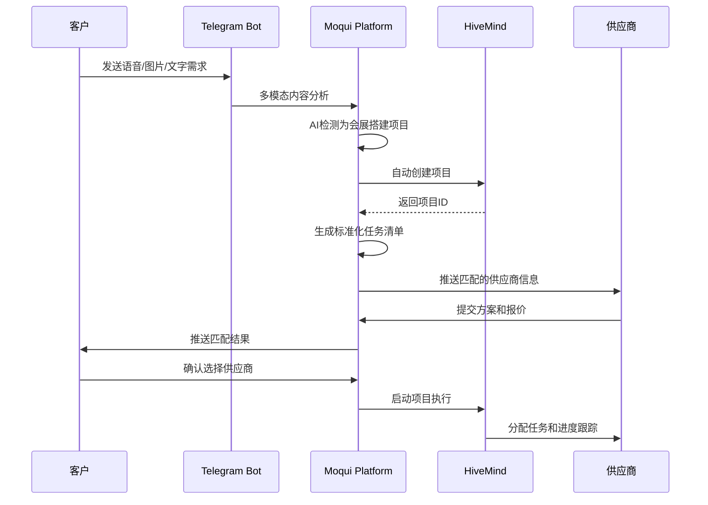

# 会展搭建项目管理系统实施方案

## 📋 执行摘要

基于用户需求分析，本方案将智能供需平台转型为项目驱动的B2B服务平台，重点聚焦会展搭建和社区装修等短频快项目场景。通过集成HiveMind项目管理能力和多模态AI识别技术，为商业客户提供基于项目的信息化服务能力。

## 🎯 战略目标

### 核心转型
- **从**: 简单供需撮合模式
- **到**: 项目驱动的综合服务平台

### 目标场景
- **会展中心搭建**: 短期项目（3-7天）、专业化团队、标准化流程
- **社区装修项目**: 中期项目（1-3周）、本地化服务、个性化需求
- **B2B服务模式**: 企业级客户、项目管理集成、AI辅助决策

## 🏗️ 技术架构设计

### 1. 系统架构概览

```
┌─────────────────────────────────────────────────────────────┐
│                    多模态AI接口层                               │
├─────────────────┬─────────────────┬─────────────────────────┤
│   文本处理       │    语音识别      │      图像识别            │
│ (智谱GLM-4)     │ (智谱Speech)    │   (智谱GLM-4V)          │
└─────────────────┴─────────────────┴─────────────────────────┘
                            │
┌─────────────────────────────────────────────────────────────┐
│                   项目检测与分类引擎                           │
├─────────────────┬─────────────────┬─────────────────────────┤
│   关键词匹配     │   意图识别      │      项目类型分类        │
│   (展台/装修)    │   (AI理解)      │   (会展/装修/其他)      │
└─────────────────┴─────────────────┴─────────────────────────┘
                            │
┌─────────────────────────────────────────────────────────────┐
│                   HiveMind项目管理集成                        │
├─────────────────┬─────────────────┬─────────────────────────┤
│   项目自动创建   │   任务分解      │      进度跟踪            │
│   (API调用)     │   (模板化)      │   (实时同步)            │
└─────────────────┴─────────────────┴─────────────────────────┘
                            │
┌─────────────────────────────────────────────────────────────┐
│                   Moqui业务流程层                             │
├─────────────────┬─────────────────┬─────────────────────────┤
│   项目信息管理   │   供应商匹配    │      客户服务界面        │
│ (Marketplace)   │ (智能算法)      │   (Vue3+Quasar2)       │
└─────────────────┴─────────────────┴─────────────────────────┘
```

### 2. 核心组件详细设计

#### 2.1 项目检测引擎 (`MarketplaceProjectDetector.java`)

**功能**: 智能识别用户输入是否属于项目型需求

**技术实现**:
```java
public class MarketplaceProjectDetector {
    // 项目关键词库
    private static final Set<String> EXHIBITION_KEYWORDS = Set.of(
        "展台", "搭建", "会展", "展览", "布展", "展位", "展会"
    );

    private static final Set<String> RENOVATION_KEYWORDS = Set.of(
        "装修", "改造", "翻新", "设计", "施工", "家装", "工装"
    );

    // AI意图识别
    public ProjectType detectProjectType(String description) {
        // 1. 关键词匹配
        if (containsKeywords(description, EXHIBITION_KEYWORDS)) {
            return ProjectType.EXHIBITION_SETUP;
        }

        // 2. AI语义理解 (智谱GLM-4)
        String prompt = "分析以下描述是否为项目型需求: " + description;
        String aiResponse = callZhipuAI(prompt);

        return parseProjectType(aiResponse);
    }
}
```

#### 2.2 HiveMind集成服务 (Moqui Service实现)

**功能**: 自动创建和管理项目，连接Moqui与HiveMind

**技术实现** - 基于Moqui Service模式：
```xml
<!-- HiveMind集成服务定义 -->
<service verb="create" noun="HiveMindProject" authenticate="true">
    <description>创建HiveMind项目并建立Moqui关联</description>
    <in-parameters>
        <parameter name="listingId" required="true"/>
        <parameter name="clientName" required="true"/>
        <parameter name="projectType" default="EXHIBITION_SETUP"/>
        <parameter name="estimatedBudget" type="BigDecimal"/>
        <parameter name="venueSize" type="String"/>
        <parameter name="displayType" type="String"/>
    </in-parameters>
    <out-parameters>
        <parameter name="hiveMindProjectId"/>
        <parameter name="workEffortId"/>
        <parameter name="success" type="Boolean"/>
    </out-parameters>
    <actions><script><![CDATA[
        // 1. 创建Moqui WorkEffort项目
        def workEffortId = ec.service.sync().name("create", "WorkEffort").parameters([
            workEffortTypeId: "PROJECT",
            workEffortName: "会展搭建项目-${clientName}",
            description: "展台面积: ${venueSize}, 展示类型: ${displayType}",
            estimatedWorkCost: estimatedBudget,
            statusId: "WIP_PROJECT_ACTIVE"
        ]).call().workEffortId

        // 2. 调用HiveMind REST API创建项目
        def hiveMindEndpoint = ec.resource.getLocationReference("https://hivemind.example.com/api/projects")
        def requestBody = [
            name: "会展搭建项目-${clientName}",
            description: "Moqui工作编号: ${workEffortId}",
            clientInfo: clientName,
            venueDetails: [size: venueSize, type: displayType],
            budget: estimatedBudget
        ]

        def response = ec.resource.httpClientRequest(hiveMindEndpoint, requestBody)
        def hiveMindProjectId = response.projectId

        // 3. 建立关联关系
        ec.entity.makeValue("marketplace.project.HiveMindProject").setAll([
            workEffortId: workEffortId,
            hiveMindProjectId: hiveMindProjectId,
            listingId: listingId,
            syncStatus: "SYNCED"
        ]).setSequencedIdPrimary().create()

        // 4. 生成标准化任务
        generateExhibitionTasks(workEffortId, hiveMindProjectId)

        success = true
    ]]></script></actions>
</service>

<!-- 任务生成辅助方法 -->
<service verb="generate" noun="ExhibitionTasks" authenticate="true">
    <in-parameters>
        <parameter name="workEffortId" required="true"/>
        <parameter name="hiveMindProjectId" required="true"/>
    </in-parameters>
    <actions><script><![CDATA[
        def taskTemplates = [
            [name: "需求确认", description: "确认展台尺寸、风格、预算", sequenceNum: 1],
            [name: "设计方案", description: "提供3D设计图和材料清单", sequenceNum: 2],
            [name: "材料采购", description: "订购展台结构和装饰材料", sequenceNum: 3],
            [name: "现场搭建", description: "按照设计图进行现场组装", sequenceNum: 4],
            [name: "验收交付", description: "客户验收确认，项目交付", sequenceNum: 5]
        ]

        taskTemplates.each { task ->
            // 在Moqui中创建子任务
            def childWorkEffortId = ec.service.sync().name("create", "WorkEffort").parameters([
                parentWorkEffortId: workEffortId,
                workEffortTypeId: "TASK",
                workEffortName: task.name,
                description: task.description,
                sequenceNum: task.sequenceNum,
                statusId: "WIP_TASK_CREATED"
            ]).call().workEffortId

            // 同步到HiveMind
            def hiveMindTaskEndpoint = ec.resource.getLocationReference("https://hivemind.example.com/api/projects/${hiveMindProjectId}/tasks")
            ec.resource.httpClientRequest(hiveMindTaskEndpoint, [
                name: task.name,
                description: task.description,
                moquiWorkEffortId: childWorkEffortId,
                sequenceNumber: task.sequenceNum
            ])
        }
    ]]></script></actions>
</service>
```
```

#### 2.3 多模态AI处理增强 (`MarketplaceMcpService.java`)

**现有能力**: 已完成智谱AI GLM-4/GLM-4V集成
**增强功能**: 项目场景专用AI提示词和处理逻辑

```java
// 新增: 项目检测专用AI处理
public class MarketplaceMcpService {

    // 会展搭建场景语音处理
    public String processExhibitionVoiceInput(String transcription) {
        String prompt = """
            分析以下语音转录内容，提取会展搭建项目关键信息：
            - 展位面积和位置
            - 展示产品类型
            - 预算范围
            - 时间要求
            - 特殊需求

            转录内容: %s

            请以JSON格式返回结构化信息。
        """.formatted(transcription);

        return callZhipuAI(prompt);
    }

    // 装修场景图像识别
    public String processRenovationImageInput(String imageUrl) {
        String prompt = """
            分析这张图片，识别装修项目相关信息：
            - 空间类型（办公室/住宅/商铺）
            - 现状描述
            - 可能的改造需求
            - 风格偏好线索
            - 空间尺寸估算

            请用中文详细描述分析结果。
        """;

        return analyzeWithZhipuVision(imageUrl, prompt);
    }
}
```

## 📊 数据模型设计

### 项目实体扩展

```xml
<!-- 新增: 项目信息实体 -->
<entity entity-name="ProjectInfo" package="marketplace.project">
    <field name="projectId" type="id" is-pk="true"/>
    <field name="listingId" type="id"/>
    <field name="hiveMindProjectId" type="text-medium"/>
    <field name="projectType" type="text-short"/> <!-- EXHIBITION_SETUP, RENOVATION, etc -->
    <field name="status" type="text-short"/> <!-- CREATED, IN_PROGRESS, COMPLETED -->
    <field name="clientName" type="text-medium"/>
    <field name="contactInfo" type="text-medium"/>
    <field name="projectDescription" type="text-long"/>
    <field name="estimatedBudget" type="currency-amount"/>
    <field name="estimatedDuration" type="number-integer"/> <!-- 天数 -->
    <field name="createdDate" type="date-time"/>
    <field name="completedDate" type="date-time"/>
    <relationship type="one" related="marketplace.listing.Listing"/>
</entity>

<!-- 新增: 项目任务跟踪 -->
<entity entity-name="ProjectTask" package="marketplace.project">
    <field name="taskId" type="id" is-pk="true"/>
    <field name="projectId" type="id"/>
    <field name="hiveMindTaskId" type="text-medium"/>
    <field name="taskName" type="text-medium"/>
    <field name="description" type="text-long"/>
    <field name="status" type="text-short"/>
    <field name="assignedTo" type="id"/>
    <field name="startDate" type="date-time"/>
    <field name="dueDate" type="date-time"/>
    <field name="completedDate" type="date-time"/>
    <relationship type="one" related="ProjectInfo"/>
</entity>
```

## 🔄 业务流程设计

### 会展搭建项目流程



### 关键业务规则

1. **项目识别阈值**: AI置信度 > 0.8 才自动创建项目
2. **供应商匹配**: 地理位置 < 50km，历史评分 > 4.0
3. **项目模板**: 根据项目类型自动应用标准化模板
4. **进度同步**: HiveMind项目状态每日同步至Moqui
5. **质量控制**: 项目完成后强制客户评价和反馈

## 🛠️ 实施计划

### Phase 1: 基础架构搭建 (1-2周)

**目标**: 建立项目检测和HiveMind集成基础

**任务清单**:
- [ ] 完成Dashboard.xml中11处div标签修复 (`container` + `section-iterate`)
- [ ] 实现`MarketplaceProjectDetector.java`项目类型检测
- [ ] 配置HiveMind API连接和认证
- [ ] 创建项目相关数据实体 (`ProjectInfo`, `ProjectTask`)
- [ ] 建立项目创建基础服务

**技术要点**:
```xml
<!-- Dashboard.xml修复示例 -->
<!-- BEFORE: Vue 3.x不兼容 -->
<div class="stats-card">
    <div class="card-body">
        <h5>项目统计</h5>
    </div>
</div>

<!-- AFTER: Moqui容器组件 -->
<container style="q-card q-card--bordered q-card--flat">
    <container style="q-card__section">
        <label text="项目统计" style="text-h6"/>
    </container>
</container>
```

**验收标准**:
- Dashboard页面无"=== Doing nothing for element div ===" 警告
- 项目检测API能识别会展和装修关键词
- HiveMind API连接测试通过

### Phase 2: 智能项目检测集成 (2-3周)

**目标**: 实现多模态AI输入的项目智能识别

**任务清单**:
- [ ] 扩展`MarketplaceMcpService.java`项目场景处理
- [ ] 实现会展搭建专用AI提示词优化
- [ ] 添加装修项目图像识别逻辑
- [ ] 建立项目类型置信度评分机制
- [ ] 创建项目信息结构化提取功能

**技术实现**:
```java
// 项目检测置信度算法
public class ProjectConfidenceCalculator {
    public double calculateConfidence(String input, List<String> keywords) {
        double keywordScore = calculateKeywordMatch(input, keywords);
        double semanticScore = callAISemanticAnalysis(input);
        double contextScore = analyzeBusinessContext(input);

        return (keywordScore * 0.3 + semanticScore * 0.5 + contextScore * 0.2);
    }
}
```

**验收标准**:
- 项目识别准确率 > 85%
- 支持中英文混合语音输入
- 图像识别能提取空间和装修信息

### Phase 3: HiveMind项目管理集成 (3-4周)

**目标**: 实现自动项目创建和任务管理

**任务清单**:
- [ ] 开发`HiveMindIntegrationService.java`完整API集成
- [ ] 创建会展搭建项目标准化模板
- [ ] 实现项目任务自动分解和分配
- [ ] 建立项目进度实时同步机制
- [ ] 开发项目管理用户界面

**HiveMind API集成**:
```java
// HiveMind项目创建API调用
@Service
public class HiveMindApiClient {

    @Value("${hivemind.api.base:http://localhost:8080/hivemind}")
    private String apiBase;

    public String createProject(ProjectTemplate template) {
        HttpEntity<ProjectTemplate> request = new HttpEntity<>(template, headers);
        ResponseEntity<ProjectResponse> response = restTemplate.postForEntity(
            apiBase + "/projects", request, ProjectResponse.class);
        return response.getBody().getProjectId();
    }
}
```

**验收标准**:
- 自动项目创建成功率 > 95%
- 项目任务模板化应用
- 实时进度同步延迟 < 5分钟

### Phase 4: 用户体验优化和生产发布 (2-3周)

**目标**: 完善用户界面和系统稳定性

**任务清单**:
- [ ] Vue 3.x + Quasar 2.x项目管理界面开发
- [ ] Telegram Bot项目交互流程优化
- [ ] 系统性能优化和负载测试
- [ ] 用户培训文档和操作指南
- [ ] 生产环境部署和监控

**用户界面设计**:
```xml
<!-- 项目管理仪表板 -->
<screen xmlns:xsi="http://www.w3.org/2001/XMLSchema-instance"
        xsi:noNamespaceSchemaLocation="http://moqui.org/xsd/screen-3.xsd">
    <transition name="getProjectList">
        <service-call name="marketplace.project.get#ProjectList"/>
        <default-response type="screen-path" save-parameters="true"/>
    </transition>

    <widgets>
        <container style="q-page q-page--padding">
            <container style="q-card">
                <container style="q-card__section">
                    <label text="项目管理仪表板" style="text-h4"/>
                </container>

                <section-iterate name="ProjectList" list="projectList" entry="project">
                    <widgets>
                        <container style="q-card q-ma-sm">
                            <container style="q-card__section">
                                <label text="${project.projectName}" style="text-h6"/>
                                <label text="状态: ${project.status}"/>
                                <label text="进度: ${project.completionRate}%"/>
                            </container>
                        </container>
                    </widgets>
                </section-iterate>
            </container>
        </container>
    </widgets>
</screen>
```

**验收标准**:
- Chrome MCP验证页面渲染完整
- 用户操作流程完整闭环
- 系统响应时间 < 2秒

## 📈 预期效果和成功指标

### 业务指标
- **项目转换率**: 从需求描述到项目创建 > 60%
- **客户满意度**: 项目完成后评分 > 4.5/5.0
- **项目完成率**: 按时完成项目 > 80%
- **供应商参与度**: 活跃供应商数量增长 > 50%

### 技术指标
- **系统可用性**: 99.5% uptime
- **API响应时间**: 平均 < 1秒
- **AI识别准确率**: > 90%
- **项目创建成功率**: > 95%

### 用户体验指标
- **操作流程完成率**: > 85%
- **用户留存率**: 月活跃用户保持 > 70%
- **多模态输入使用率**: 语音+图像输入占比 > 40%

## 🔒 风险评估和缓解措施

### 技术风险
1. **HiveMind集成复杂度**: 预留额外40%集成时间
2. **AI识别准确性**: 建立人工审核后备机制
3. **Vue 3.x兼容性**: 强制Chrome MCP验证协议

### 业务风险
1. **用户接受度**: 分阶段发布，收集用户反馈
2. **供应商培训**: 提供详细操作指南和技术支持
3. **竞争对手**: 突出AI+项目管理差异化优势

### 缓解策略
- 建立回滚机制，关键修改前备份
- 实施渐进式发布，先内测再公测
- 设置监控告警，异常情况自动通知
- 保持文档同步更新，确保可维护性

## 📝 总结

本实施方案将智能供需平台成功转型为项目驱动的B2B服务平台，通过HiveMind集成和多模态AI能力，为会展搭建和装修项目提供专业化信息服务。预计在10-12周内完成完整实施，实现从传统撮合到智能项目管理的跨越式升级。

**立即行动项**:
1. 完成Dashboard.xml的div标签修复（Phase 1优先级最高）
2. 建立HiveMind API测试连接
3. 开始项目检测逻辑的核心算法开发

*文档版本: v1.0*
*创建日期: 2025-11-02*
*审核状态: 待Codex审核*