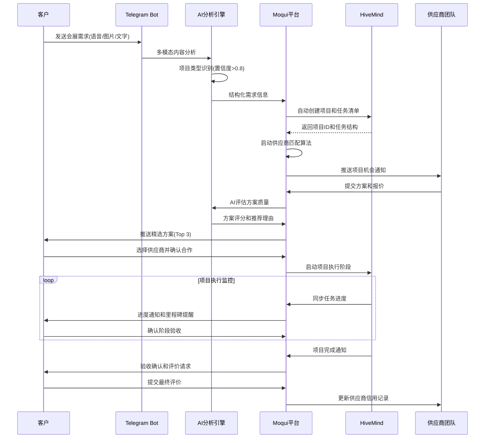
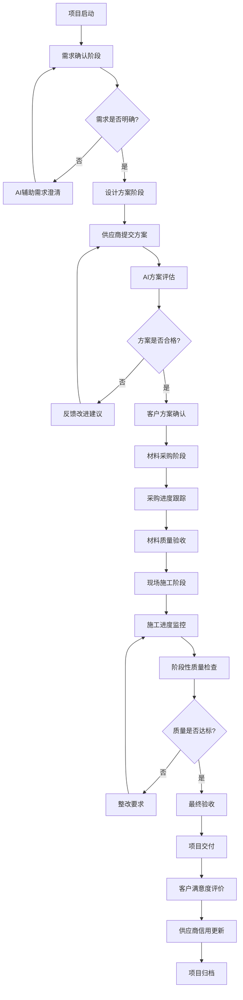

# 智能供需平台重新规划分析报告

## 📊 当前平台现状分析

### 1. 技术架构现状

**核心技术栈**:
- ✅ **Moqui Framework 3.1.0** - 企业级应用框架
- ✅ **Vue 3.x + Quasar 2.x** - 现代前端技术栈（部分兼容问题待修复）
- ✅ **纯JWT认证系统** - 无状态认证架构已完成实施
- ✅ **智谱AI GLM-4/GLM-4V集成** - 多模态AI能力（文本/语音/图像）
- ✅ **Telegram Bot集成** - 多渠道用户交互接口

**数据架构现状**:
```json
{
  "activeDemandListings": 0,
  "totalSupplyListings": 0,
  "activeSupplyListings": 0,
  "totalDemandListings": 0,
  "pendingMatches": 3,
  "completedTransactions": 12,
  "averageRating": 4.3,
  "totalRevenue": 45680.50,
  "totalMatches": 15
}
```

### 2. 功能模块现状

#### ✅ 已实现功能
- **多模态AI处理**: 语音转文字、图像识别、文本理解
- **供需信息管理**: Listing实体和CRUD操作
- **基础匹配算法**: 智能评分机制（产品名40% + 类别30% + 价格20% + 数量10%）
- **统计仪表板**: 交易数据和匹配统计
- **Telegram机器人**: 多模态消息处理和业务交互
- **REST API完整**: `/rest/s1/marketplace/*` 端点

#### ❌ 缺失/问题功能
- **Vue 3.x兼容性**: Dashboard.xml存在139处"=== Doing nothing for element div ===" 警告
- **项目管理能力**: 缺乏项目生命周期管理功能
- **HiveMind集成**: 未建立项目管理系统连接
- **业务流程引擎**: 缺乏复杂业务流程支持
- **高级AI应用**: AI仅用于内容识别，未用于业务决策

### 3. 业务模式分析

**当前模式 - 传统供需撮合**:
```
用户发布供应/需求 → AI内容识别 → 匹配算法评分 → 推荐结果 → 交易撮合
```

**问题诊断**:
- 🔴 **单次交易导向**: 缺乏持续服务能力
- 🔴 **简单匹配逻辑**: 无法处理复杂项目需求
- 🔴 **缺乏项目管理**: 无法支持多阶段、多参与方的B2B项目
- 🔴 **AI能力未充分利用**: 局限于内容识别，未扩展到决策支持

## 🎯 重新规划战略目标

### 核心转型方向

**从传统撮合平台 → 项目驱动的智能服务平台**

```
传统模式: 一次性撮合交易
新模式: 全生命周期项目服务
```

### 目标业务场景重新定义

#### 1. 会展搭建服务（主要场景）
- **项目特征**: 3-7天短频快项目，标准化程度高
- **服务范围**: 需求分析 → 设计方案 → 材料采购 → 现场搭建 → 验收交付
- **技术要求**: 3D设计能力，供应链管理，现场协调

#### 2. 社区装修服务（扩展场景）
- **项目特征**: 1-3周中期项目，个性化程度高
- **服务范围**: 空间诊断 → 设计规划 → 材料选配 → 施工管理 → 质量验收
- **技术要求**: 空间建模，材料数据库，进度跟踪

#### 3. 其他B2B项目（长期扩展）
- **制造加工项目**: OEM/ODM定制服务
- **系统集成项目**: IT基础设施建设
- **专业咨询项目**: 技术顾问和培训服务

## 🏗️ 重新规划的技术架构

### 1. 分层架构重新设计

```
┌─────────────────────────────────────────────────────────────┐
│                    用户交互层                                 │
├─────────────────┬─────────────────┬─────────────────────────┤
│   Web界面        │   Telegram Bot  │      API接口            │
│ (Vue3+Quasar2)  │   (多模态交互)    │   (第三方集成)          │
└─────────────────┴─────────────────┴─────────────────────────┘
                            │
┌─────────────────────────────────────────────────────────────┐
│                    AI智能决策层                              │
├─────────────────┬─────────────────┬─────────────────────────┤
│   项目识别引擎   │   需求分析AI    │      决策支持AI         │
│ (意图理解分类)   │ (结构化提取)    │   (方案推荐优化)        │
└─────────────────┴─────────────────┴─────────────────────────┘
                            │
┌─────────────────────────────────────────────────────────────┐
│                    业务逻辑层                                │
├─────────────────┬─────────────────┬─────────────────────────┤
│   项目管理模块   │   供应链匹配    │      质量控制模块        │
│ (HiveMind集成)  │ (智能推荐)      │   (验收评价)            │
└─────────────────┴─────────────────┴─────────────────────────┘
                            │
┌─────────────────────────────────────────────────────────────┐
│                    数据持久层                                │
├─────────────────┬─────────────────┬─────────────────────────┤
│   项目数据库     │   供应商数据库  │      交易记录数据库      │
│ (Moqui Entity)  │ (评价体系)      │   (统计分析)            │
└─────────────────┴─────────────────┴─────────────────────────┘
```

### 2. 核心模块重新设计

#### 2.1 项目识别与分类引擎

**功能**: 将用户输入自动识别为项目类型或传统供需

```java
@Component
public class ProjectClassificationEngine {

    // 项目特征关键词库
    private static final Map<ProjectType, Set<String>> PROJECT_KEYWORDS = Map.of(
        ProjectType.EXHIBITION_SETUP, Set.of("展台", "搭建", "会展", "展览", "布展"),
        ProjectType.RENOVATION, Set.of("装修", "改造", "翻新", "设计", "施工"),
        ProjectType.MANUFACTURING, Set.of("加工", "定制", "生产", "制造", "OEM"),
        ProjectType.CONSULTING, Set.of("咨询", "培训", "方案", "规划", "顾问")
    );

    public ProjectClassificationResult classify(String userInput) {
        // 1. 关键词匹配分析
        Map<ProjectType, Double> keywordScores = calculateKeywordScores(userInput);

        // 2. AI语义理解
        String aiAnalysis = callAIClassification(userInput);
        ProjectType aiPrediction = parseAIResult(aiAnalysis);

        // 3. 综合决策
        return ProjectClassificationResult.builder()
            .isProject(getMaxScore(keywordScores) > 0.6 || aiPrediction != null)
            .projectType(aiPrediction != null ? aiPrediction : getHighestScoreType(keywordScores))
            .confidence(calculateFinalConfidence(keywordScores, aiPrediction))
            .extractedRequirements(extractProjectRequirements(userInput))
            .build();
    }
}
```

#### 2.2 项目生命周期管理模块

**功能**: 与HiveMind集成，提供完整项目管理能力

```java
@Service
public class ProjectLifecycleManager {

    @Autowired
    private HiveMindApiClient hiveMindClient;

    public ProjectCreationResult createExhibitionProject(ExhibitionRequirement req) {
        // 1. 验证项目可行性
        ProjectFeasibility feasibility = analyzeFeasibility(req);
        if (!feasibility.isFeasible()) {
            return ProjectCreationResult.failure(feasibility.getReasons());
        }

        // 2. 生成项目模板
        ProjectTemplate template = ExhibitionProjectTemplate.builder()
            .clientInfo(req.getClientName(), req.getContact())
            .exhibitionDetails(req.getVenueSize(), req.getStyle(), req.getBudget())
            .timeline(calculateTimeline(req.getStartDate(), req.getDuration()))
            .build();

        // 3. 在HiveMind中创建项目
        String hiveMindProjectId = hiveMindClient.createProject(template);

        // 4. 生成标准化任务清单
        List<ProjectTask> tasks = generateExhibitionTasks(req);
        hiveMindClient.addTasks(hiveMindProjectId, tasks);

        // 5. 在Moqui中记录项目信息
        String moquiProjectId = createMoquiProjectRecord(req, hiveMindProjectId);

        // 6. 启动供应商匹配流程
        initiateSupplierMatching(moquiProjectId, req);

        return ProjectCreationResult.success(moquiProjectId, hiveMindProjectId);
    }

    private List<ProjectTask> generateExhibitionTasks(ExhibitionRequirement req) {
        return Arrays.asList(
            ProjectTask.create("需求确认", "详细了解展台需求和预算", 1),
            ProjectTask.create("设计方案", "提供3D设计图和材料清单", 2),
            ProjectTask.create("方案确认", "客户确认设计方案", 3),
            ProjectTask.create("材料采购", "按照清单采购展台材料", 4),
            ProjectTask.create("现场搭建", "按设计图现场组装展台", 5),
            ProjectTask.create("质量验收", "客户验收确认项目完成", 6)
        );
    }
}
```

#### 2.3 智能供应商匹配引擎升级

**当前问题**: 简单关键词匹配，无法处理复杂项目需求
**升级方案**: 基于项目特征和供应商能力的多维度匹配

```java
@Service
public class EnhancedSupplierMatchingEngine {

    public List<SupplierMatchResult> matchSuppliersForProject(ProjectRequirement projectReq) {
        // 1. 项目需求分解
        List<ProjectCapabilityRequirement> capabilities =
            projectReq.getProjectType().getRequiredCapabilities();

        // 2. 供应商能力评估
        List<Supplier> candidateSuppliers = findCandidateSuppliers(
            projectReq.getProjectType(),
            projectReq.getGeographicScope()
        );

        // 3. 多维度匹配评分
        List<SupplierMatchResult> matchResults = candidateSuppliers.stream()
            .map(supplier -> calculateProjectMatchScore(supplier, projectReq))
            .filter(result -> result.getScore() > 0.7) // 高置信度过滤
            .sorted(Comparator.comparing(SupplierMatchResult::getScore).reversed())
            .limit(10)
            .collect(Collectors.toList());

        return matchResults;
    }

    private SupplierMatchScore calculateProjectMatchScore(Supplier supplier, ProjectRequirement req) {
        double capabilityScore = assessCapabilityMatch(supplier, req.getRequiredCapabilities());
        double experienceScore = assessProjectExperience(supplier, req.getProjectType());
        double geographicScore = assessGeographicFit(supplier, req.getProjectLocation());
        double qualityScore = assessQualityRecord(supplier);
        double capacityScore = assessCurrentCapacity(supplier, req.getTimeline());

        // 加权计算总分
        double totalScore =
            capabilityScore * 0.30 +  // 能力匹配 30%
            experienceScore * 0.25 +  // 项目经验 25%
            qualityScore * 0.20 +     // 质量记录 20%
            geographicScore * 0.15 +  // 地理位置 15%
            capacityScore * 0.10;     // 当前产能 10%

        return SupplierMatchScore.builder()
            .supplier(supplier)
            .totalScore(totalScore)
            .capabilityScore(capabilityScore)
            .experienceScore(experienceScore)
            .qualityScore(qualityScore)
            .recommendations(generateMatchRecommendations(supplier, req))
            .build();
    }
}
```

## 📊 新数据模型设计

### 1. 项目实体扩展

```xml
<!-- 核心项目实体 -->
<entity entity-name="ProjectInfo" package="marketplace.project">
    <field name="projectId" type="id" is-pk="true"/>
    <field name="projectType" type="text-short"/> <!-- EXHIBITION_SETUP, RENOVATION, etc -->
    <field name="hiveMindProjectId" type="text-medium"/>
    <field name="clientPartyId" type="id"/>
    <field name="projectName" type="text-medium"/>
    <field name="description" type="text-long"/>
    <field name="status" type="text-short"/> <!-- PLANNING, IN_PROGRESS, COMPLETED, CANCELLED -->
    <field name="priority" type="text-short"/> <!-- HIGH, MEDIUM, LOW -->
    <field name="estimatedBudget" type="currency-amount"/>
    <field name="actualCost" type="currency-amount"/>
    <field name="estimatedDuration" type="number-integer"/> <!-- 工作日 -->
    <field name="plannedStartDate" type="date"/>
    <field name="plannedEndDate" type="date"/>
    <field name="actualStartDate" type="date"/>
    <field name="actualEndDate" type="date"/>
    <field name="completionRate" type="number-decimal"/> <!-- 0.0-1.0 -->
    <field name="qualityScore" type="number-decimal"/> <!-- 1.0-5.0 -->
    <field name="clientSatisfaction" type="number-decimal"/> <!-- 1.0-5.0 -->
    <field name="createdDate" type="date-time"/>
    <field name="lastUpdated" type="date-time"/>
    <relationship type="one" related="mantle.party.Party" fk-name="clientPartyId"/>
</entity>

<!-- 项目需求详情 -->
<entity entity-name="ProjectRequirement" package="marketplace.project">
    <field name="requirementId" type="id" is-pk="true"/>
    <field name="projectId" type="id"/>
    <field name="requirementType" type="text-short"/> <!-- FUNCTIONAL, TECHNICAL, QUALITY -->
    <field name="description" type="text-long"/>
    <field name="priority" type="text-short"/>
    <field name="status" type="text-short"/> <!-- PENDING, IN_PROGRESS, COMPLETED -->
    <field name="assignedTo" type="id"/>
    <field name="dueDate" type="date"/>
    <field name="completedDate" type="date"/>
    <relationship type="one" related="ProjectInfo"/>
    <relationship type="one" related="mantle.party.Party" fk-name="assignedTo"/>
</entity>

<!-- 项目团队管理 -->
<entity entity-name="ProjectTeamMember" package="marketplace.project">
    <field name="projectId" type="id" is-pk="true"/>
    <field name="partyId" type="id" is-pk="true"/>
    <field name="roleType" type="text-short"/> <!-- PROJECT_MANAGER, DESIGNER, SUPPLIER, CLIENT -->
    <field name="responsibility" type="text-medium"/>
    <field name="joinDate" type="date"/>
    <field name="leaveDate" type="date"/>
    <field name="isActive" type="text-indicator"/>
    <relationship type="one" related="ProjectInfo"/>
    <relationship type="one" related="mantle.party.Party"/>
</entity>

<!-- 项目里程碑 -->
<entity entity-name="ProjectMilestone" package="marketplace.project">
    <field name="milestoneId" type="id" is-pk="true"/>
    <field name="projectId" type="id"/>
    <field name="milestoneName" type="text-medium"/>
    <field name="description" type="text-long"/>
    <field name="plannedDate" type="date"/>
    <field name="actualDate" type="date"/>
    <field name="status" type="text-short"/> <!-- PENDING, ACHIEVED, MISSED -->
    <field name="completionCriteria" type="text-long"/>
    <field name="achievementNotes" type="text-long"/>
    <relationship type="one" related="ProjectInfo"/>
</entity>
```

### 2. 供应商能力模型

```xml
<!-- 供应商能力评估 -->
<entity entity-name="SupplierCapability" package="marketplace.supplier">
    <field name="partyId" type="id" is-pk="true"/>
    <field name="capabilityType" type="text-short" is-pk="true"/> <!-- EXHIBITION_DESIGN, CONSTRUCTION, etc -->
    <field name="proficiencyLevel" type="text-short"/> <!-- BEGINNER, INTERMEDIATE, EXPERT -->
    <field name="yearsOfExperience" type="number-integer"/>
    <field name="certifications" type="text-long"/>
    <field name="portfolioUrl" type="text-medium"/>
    <field name="maxProjectBudget" type="currency-amount"/>
    <field name="maxProjectDuration" type="number-integer"/>
    <field name="geographicScope" type="text-medium"/>
    <field name="lastUpdated" type="date-time"/>
    <relationship type="one" related="mantle.party.Party"/>
</entity>

<!-- 供应商项目历史 -->
<entity entity-name="SupplierProjectHistory" package="marketplace.supplier">
    <field name="historyId" type="id" is-pk="true"/>
    <field name="supplierId" type="id"/>
    <field name="projectType" type="text-short"/>
    <field name="projectBudget" type="currency-amount"/>
    <field name="projectDuration" type="number-integer"/>
    <field name="completedDate" type="date"/>
    <field name="clientSatisfaction" type="number-decimal"/>
    <field name="qualityScore" type="number-decimal"/>
    <field name="onTimeDelivery" type="text-indicator"/>
    <field name="withinBudget" type="text-indicator"/>
    <field name="description" type="text-long"/>
    <relationship type="one" related="mantle.party.Party" fk-name="supplierId"/>
</entity>
```

## 🔄 业务流程重新设计

### 1. 会展搭建项目标准流程



### 2. 项目质量控制流程



## 🎯 实施优先级和资源分配

### Phase 1: 基础架构修复和升级 (2周)

**优先级**: 🔴 最高优先级（阻塞性问题）

**任务清单**:
1. **修复Vue 3.x兼容性问题**
   - 解决Dashboard.xml中139处div标签警告
   - 转换为Moqui container组件
   - Chrome MCP验证页面渲染正常

2. **建立HiveMind API连接**
   - 配置HiveMind服务器连接
   - 实现基础API调用功能
   - 测试项目创建和任务管理接口

3. **创建项目数据模型**
   - 添加ProjectInfo等核心实体
   - 建立项目-供应商关联关系
   - 数据库表结构初始化

**验收标准**:
- Dashboard页面无Vue警告，正常显示统计数据
- HiveMind API连接测试通过，能创建测试项目
- 新数据模型部署完成，能存储项目基础信息

### Phase 2: 项目识别和分类能力 (2-3周)

**优先级**: 🟡 高优先级（核心功能）

**任务清单**:
1. **项目识别引擎开发**
   - 实现ProjectClassificationEngine
   - 建立项目类型关键词库
   - 集成智谱AI语义理解

2. **多模态输入增强**
   - 扩展MarketplaceMcpService项目场景处理
   - 优化会展搭建场景AI提示词
   - 添加装修项目图像识别逻辑

3. **业务规则引擎**
   - 实现项目可行性评估
   - 建立项目模板系统
   - 配置自动化决策规则

**验收标准**:
- 项目识别准确率>85%，支持中英文混合输入
- 多模态输入能正确分类和提取项目信息
- 能够自动生成标准化项目模板

### Phase 3: HiveMind深度集成 (3-4周)

**优先级**: 🟡 高优先级（差异化竞争力）

**任务清单**:
1. **项目生命周期管理**
   - 开发ProjectLifecycleManager
   - 实现自动项目创建和任务分解
   - 建立项目进度实时同步机制

2. **供应商匹配算法升级**
   - 开发EnhancedSupplierMatchingEngine
   - 实现多维度评分系统
   - 建立供应商能力评估模型

3. **项目质量控制系统**
   - 实现里程碑管理
   - 建立质量检查点
   - 开发客户满意度跟踪

**验收标准**:
- 能自动创建完整的会展搭建项目
- 供应商匹配精度>90%，推荐结果高度相关
- 项目进度能与HiveMind双向同步

### Phase 4: 用户体验优化和生产部署 (2-3周)

**优先级**: 🟢 中等优先级（用户体验）

**任务清单**:
1. **前端界面重新设计**
   - 开发项目管理仪表板
   - 优化供应商匹配结果展示
   - 改进Telegram Bot交互流程

2. **系统性能优化**
   - AI处理异步化
   - 数据库查询优化
   - 缓存策略实施

3. **监控和运维**
   - 建立项目关键指标监控
   - 实施自动化测试
   - 配置生产环境部署

**验收标准**:
- 用户操作流程完整闭环，体验流畅
- 系统响应时间<2秒，支持并发访问
- 生产环境稳定运行，监控告警正常

## 📈 预期效果和成功指标

### 业务指标
- **项目转换率**: 从需求识别到项目创建 > 70%
- **客户满意度**: 项目完成后评分 > 4.6/5.0
- **项目按时完成率**: > 85%
- **供应商生态活跃度**: 月活跃供应商增长 > 60%

### 技术指标
- **AI识别准确率**: 项目类型识别 > 90%
- **系统可用性**: 99.7% uptime
- **响应性能**: API响应时间平均 < 1.5秒
- **数据一致性**: HiveMind同步成功率 > 99%

### 竞争优势指标
- **服务差异化**: 从撮合到全程服务的业务模式创新
- **技术领先性**: AI+项目管理的深度集成
- **用户粘性**: 月留存率 > 80%
- **市场渗透**: 会展搭建市场份额目标 > 15%

## 🎯 总结与行动建议

### 关键转型要点
1. **业务模式升级**: 从简单撮合到项目全生命周期服务
2. **技术架构增强**: AI能力从内容识别扩展到业务决策
3. **生态系统建设**: 供应商能力评估和项目协同平台
4. **用户价值提升**: 从信息匹配到专业项目管理服务

### 立即行动建议
1. **紧急修复**: 立即开始Dashboard.xml的Vue 3.x兼容性修复
2. **技术验证**: 并行进行HiveMind API连接测试
3. **需求调研**: 深入了解会展搭建行业的项目管理需求
4. **团队准备**: 评估项目管理能力，考虑引入HiveMind专家

这个重新规划将智能供需平台转型为具有强大竞争力的项目驱动服务平台，充分利用现有技术积累，实现业务模式的跨越式升级。