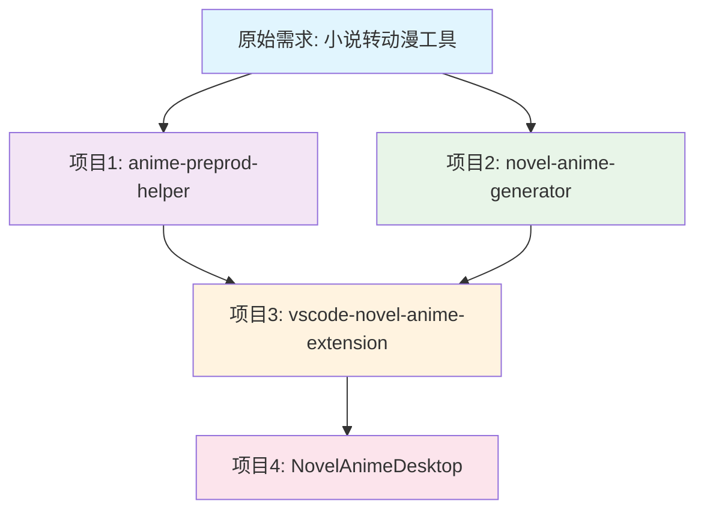

# 小说动漫生成器项目关系图

## 🎯 项目发展历程和关系

你现在确实有**4个相关项目**，让我为你梳理它们的关系：



## 📋 各项目详细说明

### 1️⃣ **frontend/anime-preprod-helper** 
**🎭 最早的原型项目**
- **创建时间**: 最早
- **类型**: VS Code扩展原型
- **状态**: 基础功能，简单实现
- **特点**: 
  - 简单的VS Code扩展
  - 基础的工作流编辑器
  - 资产库树形视图
  - 概念验证阶段

### 2️⃣ **frontend/novel-anime-generator**
**🏭 完整的前端应用**
- **创建时间**: 第二阶段
- **类型**: Vue.js Web应用
- **状态**: **功能最完整** (95%完成度)
- **特点**:
  - 完整的Vue 3 + Quasar应用
  - 431个测试通过 (99.1%通过率)
  - 完整的小说到视频处理管道
  - 专业级IDE风格界面
  - **这是功能最完整的版本**

### 3️⃣ **vscode-novel-anime-extension**
**🔧 VS Code扩展版本**
- **创建时间**: 第三阶段
- **类型**: 专业VS Code扩展
- **状态**: 部分完成 (61%完成度)
- **特点**:
  - 基于项目2的功能重新设计
  - 完整的VS Code集成
  - TypeScript + Vue.js
  - 25+个专业组件
  - 5000+行代码

### 4️⃣ **NovelAnimeDesktop** 
**🖥️ 独立桌面应用**
- **创建时间**: 刚刚创建
- **类型**: Electron桌面应用
- **状态**: 新创建，基础功能
- **特点**:
  - 完全独立，无VS Code依赖
  - 基于Electron + Vue 3
  - 复用了项目2的组件
  - 专业的桌面应用体验

## 🎯 项目关系和用途

### 📊 功能完整度对比

| 项目 | 完成度 | 主要用途 | 推荐程度 |
|------|--------|----------|----------|
| anime-preprod-helper | 30% | 概念验证 | ⭐ |
| **novel-anime-generator** | **95%** | **完整Web应用** | **⭐⭐⭐⭐⭐** |
| vscode-novel-anime-extension | 61% | VS Code集成 | ⭐⭐⭐ |
| NovelAnimeDesktop | 20% | 独立桌面应用 | ⭐⭐ |

### 🎨 技术栈对比

| 项目 | 前端 | 后端 | 特色 |
|------|------|------|------|
| anime-preprod-helper | 基础HTML/JS | VS Code API | 简单原型 |
| **novel-anime-generator** | **Vue 3 + Quasar** | **完整服务** | **最完整** |
| vscode-novel-anime-extension | Vue.js模拟 | TypeScript | VS Code集成 |
| NovelAnimeDesktop | Vue 3 | Electron | 独立应用 |

## 🚀 推荐使用策略

### 🥇 **主力项目: novel-anime-generator**
**为什么推荐:**
- ✅ 功能最完整 (95%完成度)
- ✅ 测试覆盖最全 (431个测试)
- ✅ 架构最成熟
- ✅ 可以直接使用

**如何使用:**
```bash
cd frontend/novel-anime-generator
npm install
npm run dev
```

### 🥈 **开发者工具: vscode-novel-anime-extension**
**适合场景:**
- 你是开发者
- 喜欢在VS Code中工作
- 需要代码编辑功能

### 🥉 **独立应用: NovelAnimeDesktop**
**适合场景:**
- 不想依赖VS Code
- 需要完全独立的应用
- 但功能还不完整

## 💡 建议的发展路径

### 方案A: 专注主力项目 (推荐)
```
novel-anime-generator (95%) 
    ↓ 
完善剩余5%功能 
    ↓ 
部署为Web应用
```

### 方案B: 发展独立应用
```
novel-anime-generator (95%) 
    ↓ 
移植功能到 NovelAnimeDesktop 
    ↓ 
完整的桌面应用
```

### 方案C: 完善VS Code扩展
```
vscode-novel-anime-extension (61%) 
    ↓ 
完成剩余39%功能 
    ↓ 
发布到VS Code市场
```

## 🎯 我的建议

**立即可用**: 使用 `frontend/novel-anime-generator`，它是功能最完整的版本

**长期发展**: 根据你的目标用户选择：
- **Web用户** → 完善 novel-anime-generator
- **开发者** → 完善 vscode-novel-anime-extension  
- **普通用户** → 发展 NovelAnimeDesktop

**清理建议**: 可以考虑删除 `anime-preprod-helper`，它只是早期原型

## 🔄 项目整合建议

如果你想简化项目结构，可以：

1. **保留核心**: `novel-anime-generator` (主力)
2. **选择方向**: 
   - VS Code扩展 OR 独立桌面应用
   - 不需要两个都维护
3. **清理原型**: 删除 `anime-preprod-helper`

这样你就有一个清晰的项目结构，专注于真正有价值的版本！